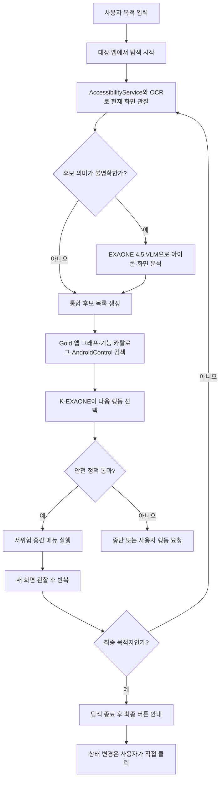

# ExitGuide Navigation

ExitGuideLab의 목적 기반 Android UI Navigation Agent 저장소입니다. 사용자가 “구독을 해지하고 싶어”, “알림을 끄고 싶어”, “회원탈퇴 메뉴를 찾고 싶어”처럼 목적을 입력하면 현재 화면을 해석하고, 그 목적에 가장 적합한 다음 메뉴를 찾아 최종 목적지까지 안내합니다.

- 팀: ExitGuideLab
- Navigation 담당: 양건
- 통합 저장소: [`exitguide-ai/exitguide`](https://github.com/exitguide-ai/exitguide)
- 이 저장소: Android 화면 인식, 동적 메뉴 탐색, 앱 기능 그래프, Gold 데이터, K-EXAONE 판단, EXAONE 4.5 VLM 연동

## 개발 목표

핵심 목표는 앱별 좌표 경로를 암기하는 매크로가 아닙니다.

> 처음 보는 Android 앱에서도 현재 화면의 선택지를 동적으로 분석하고, K-EXAONE이 사용자 목적에 맞는 다음 행동을 결정하며, 성공한 탐색 결과를 의미 기반 기능 그래프로 축적하는 범용 Navigation Agent를 만든다.

Gold는 `좌표 A → 좌표 B` 재생 경로가 아니라 다음 내용을 담는 학습·검색 사례로 사용합니다.

- 사용자 목적과 최종 기능
- 현재 화면의 문맥
- 화면에서 발견한 전체 후보
- 올바르게 선택한 후보와 잘못된 후보
- 행동 이후 도착한 화면
- 성공, 실패, 무변화와 복구 결과
- 앱 버전, locale, 검증 수준

상세 설계와 두 개의 전체 워크플로우는 [Navigation Agent 학습 아키텍처](docs/NAVIGATION_AGENT_LEARNING_ARCHITECTURE.md)에 정리되어 있습니다.

## 모델과 시스템의 역할

| 구성 요소 | 역할 |
| --- | --- |
| AccessibilityService | 텍스트, 버튼 역할, 상태, 화면 계층과 좌표 수집 |
| OCR | 접근성 정보에서 누락된 화면 문구 보충 |
| EXAONE 4.5 VLM | 이름 없는 아이콘, 이미지 버튼, WebView, 팝업과 시각 상태 분석 |
| K-EXAONE | 목적, 현재 후보와 검색 근거를 보고 다음 행동 결정 |
| Gold·기능 그래프 | 실제로 성공·실패한 화면 선택 경험 제공 |
| AndroidControl | 처음 보는 앱에서 탐색 방향을 잡는 범용 사전 사례 |
| Android 실행기 | 안전 정책을 통과한 클릭, 스크롤과 뒤로가기 실행 |

EXAONE 4.5는 눈, K-EXAONE은 판단하는 두뇌, Gold·AndroidControl·기능 그래프는 기억, Android 실행기는 손으로 사용합니다.

## 런타임 워크플로우



## 안전 원칙

- 자동 탐색은 보이고 활성화된 저위험 중간 메뉴에만 허용합니다.
- 결제, 탈퇴, 해지 확정, 환불, 동의, 권한 변경, 토글, 체크박스, 라디오 버튼과 텍스트 입력은 자동 실행하지 않습니다.
- 최종 목적지에 도착하면 탐색을 자동 종료하고 최종 상태 변경은 사용자에게 맡깁니다.
- 모델이 임의의 좌표를 만들어 클릭하지 않습니다. 현재 화면에서 관찰된 후보 ID를 Android 실행기가 다시 검증합니다.
- 화면 또는 후보를 확실하게 식별할 수 없으면 추측 클릭 대신 복구하거나 중단합니다.
- 민감 정보가 포함된 `.env`, 원본 스크린샷과 로컬 DB는 Git에 올리지 않습니다.

## 현재 구현 범위

- FastAPI 기반 Navigation API와 Hermes 도구 계약
- Android AccessibilityService와 플로팅 오버레이
- 목적 입력 후 대상 앱에서 시작하는 탐색 UX
- 클릭, 화면 단위 스크롤, 뒤로가기와 탐색 종료
- 이름 없는 후보를 보완하는 OCR 좌표 후보
- 화면·행동·전이·경로를 저장하는 SQLite 기능 그래프
- 앱·버전·기능별 `shadow → verified_candidate → verified → trusted` 경로 생명주기
- 재방문, 무한 스크롤, 무변화와 잘못된 화면에 대한 복구·중단 규칙
- 범용 기능 카탈로그와 목적 resolver
- 공식 AndroidControl 20개 shard의 83,848개 단계 v3 인덱스와 런타임 Top-K 검색
- K-EXAONE 매 화면 Hermes planner, fail-closed 실행 계약과 retrieval trace
- EXAONE 4.5 VLM의 이름 없는 아이콘 선택 호출과 개인정보 비저장 캐시
- Human Gold 21개를 변환한 SFT·선호학습 자료와 앱 단위 분리 평가
- 실기기·에뮬레이터 관찰 수집, 개인정보 제거, 오프라인 재생과 평가 도구
- 유튜브·넷플릭스·배민 실기기 탐색과 일부 Human Gold 검증
- Windows MVP 실행 파일과 시연 영상

수치와 완료·미완료 항목은 [현재 프로젝트 현황](docs/CURRENT_PROJECT_STATUS.md)을 참고합니다. 세부 변경 이력은 [개발 로그](docs/DEVELOPMENT_LOG.md)에 있습니다.

## 저장소 구조

```text
exitguide-navigation/
├─ apps/
│  ├─ api/                     # FastAPI, K-EXAONE, 기능 그래프와 탐색 정책
│  └─ mobile/                  # Android 앱, AccessibilityService와 오버레이
├─ contracts/                  # Navigation·Terms 통합 계약
├─ deploy/                     # 서버와 공개 APK 배포 설정
├─ fixtures/
│  └─ navigation/              # 기능 카탈로그, 평가·회귀·오프라인 자료
├─ scripts/                    # 빌드, 수집, 검증, 최적화와 배포 자동화
├─ docs/                       # 아키텍처, 정책, 테스트와 연구 기록
├─ dist/                       # MVP 실행 파일
└─ MVP.mp4                     # MVP 시연 영상
```

## 주요 문서

- [Navigation Agent 학습 아키텍처](docs/NAVIGATION_AGENT_LEARNING_ARCHITECTURE.md)
- [현재 프로젝트 현황](docs/CURRENT_PROJECT_STATUS.md)
- [범용 Navigation Agent](docs/UNIVERSAL_NAVIGATION_AGENT.md)
- [Navigation DB Gym](docs/NAVIGATION_DB_GYM.md)
- [AndroidControl 연동](docs/ANDROID_CONTROL.md)
- [API 계약](docs/API_CONTRACT.md)
- [실기기 Human Gold 기록](docs/GOLD_RECORDING.md)
- [휴대폰 테스트](docs/PHONE_TESTING.md)
- [공개 APK 배포](docs/PUBLIC_APK_DEPLOYMENT.md)
- [Navigation 시간 최적화](docs/NAVIGATION_TIME_OPTIMIZATION.md)
- [Navigation Agent 평가 보고서](docs/NAVIGATION_AGENT_EVALUATION.md)
- [K-EXAONE 기능 확인](docs/K_EXAONE_CAPABILITY_AUDIT.md)
- [개발 로그](docs/DEVELOPMENT_LOG.md)

## 빠른 시작

로컬 `.env`는 [`.env.example`](.env.example)을 복사해 사용합니다. 실제 API 키와 Endpoint ID가 들어 있는 `.env`는 Git에 포함하지 않습니다.

백엔드:

```powershell
cd apps\api
python -m venv .venv
.\.venv\Scripts\pip.exe install -r requirements.txt
.\.venv\Scripts\python.exe -m uvicorn app.main:app --reload --port 8010
```

모바일 앱:

```powershell
cd apps\mobile
npm ci
npm run typecheck
```

Android 로컬 빌드와 설치:

```powershell
.\scripts\Build-AndroidLocal.ps1
```

빠른 API 회귀 검사:

```powershell
.\scripts\Test-ApiUnit.ps1
```

기능 DB 검증:

```powershell
.\scripts\Test-NavigationDbGym.ps1 -Mode fast
```

## MVP

- [Navigation·다크패턴 통합 MVP 시연 영상](MVP.mp4)
- Windows 실행 파일: [`dist/EGL-Navigation-MVP.exe`](dist/EGL-Navigation-MVP.exe)

이 저장소는 Navigation 모듈의 개인 작업·실험·백업 공간입니다. 검증이 끝난 통합 변경은 `exitguide-ai/exitguide`와 계약을 맞춰 반영합니다.
