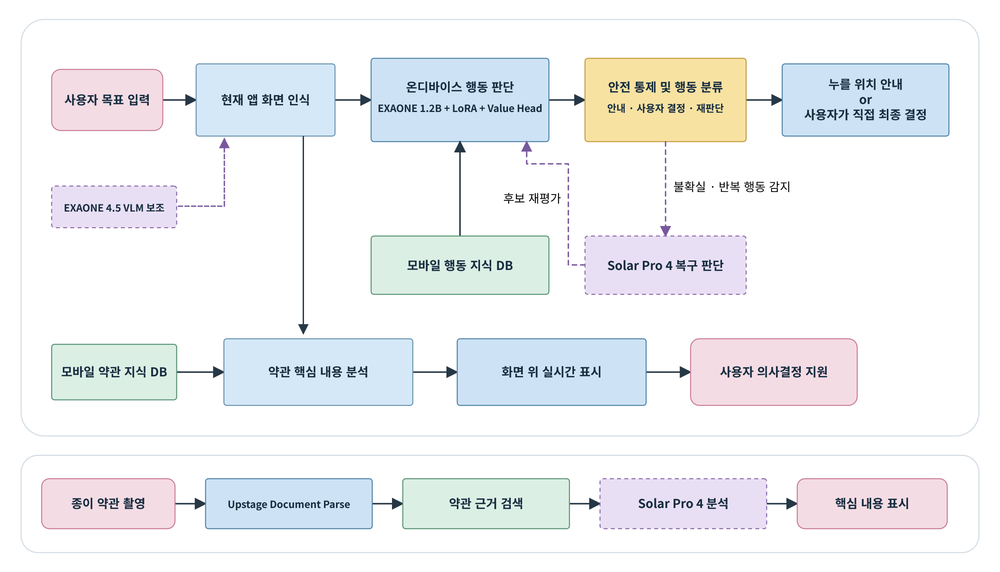
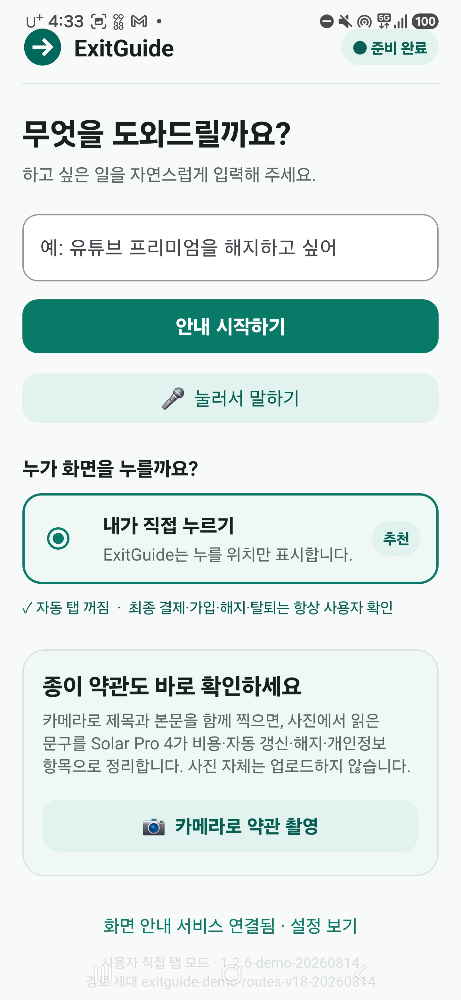
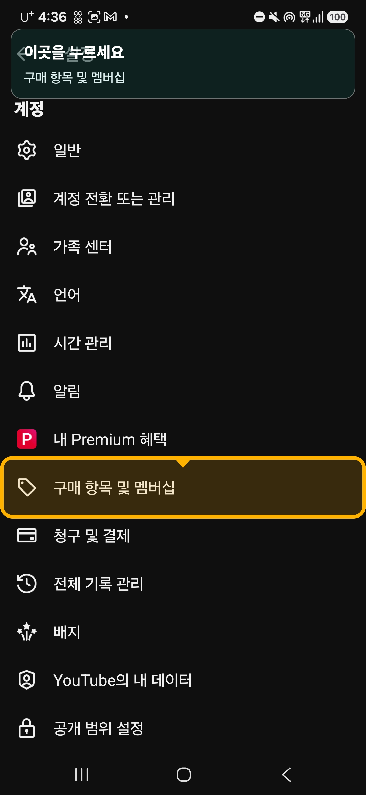
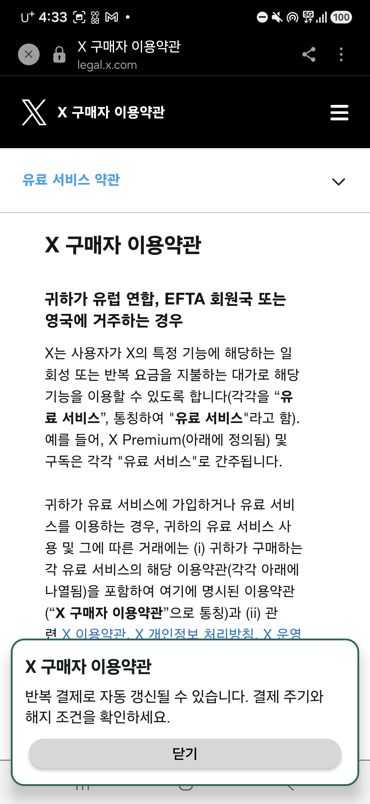
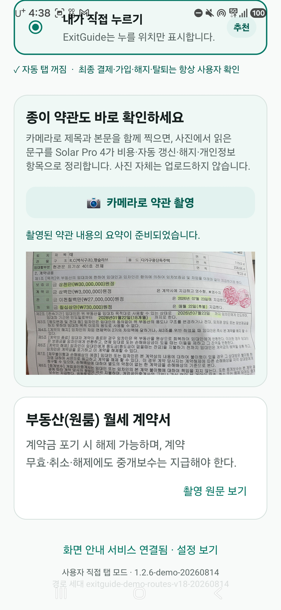

<p align="center">
  
</p>

<h1 align="center">ExitGuide AI</h1>

<p align="center">
  <strong>사용자 목표 기반 판단 보조 온디바이스 AI</strong><br>
  현재 화면을 다시 읽고, 다음에 누를 위치와 선택의 의미를 함께 설명합니다.
</p>

<p align="center">
  <a href="docs/INTEGRATED_TECHNICAL_REPORT_KR.md"><strong>통합 기술 보고서</strong></a>
  ·
  <a href="https://youtu.be/8YB3jl2YKNQ?si=f5ZpqoWffAoT5hZr"><strong>본선 시연 영상</strong></a>
  ·
  <a href="CURRENT_PRIORITY.md"><strong>현재 개발 현황</strong></a>
</p>

ExitGuide는 복잡한 모바일 절차와 약관을 사용자가 직접 이해하고 처리하도록 돕는 **온디바이스 중심 하이브리드 의사결정 보조 서비스**입니다. 사용자가 “유튜브 프리미엄 해지 화면까지 안내해 줘”처럼 목적을 입력하면 현재 화면의 후보를 비교하고, 누를 위치와 이유를 표시한 뒤 사용자의 직접 입력을 기다립니다.

결제, 동의, 가입, 해지·탈퇴 확정과 개인정보 제출은 AI가 대신 실행하지 않습니다. 중요한 선택에서는 안내를 멈추고 결과와 주의사항만 설명합니다.

> 이 README는 제품과 고정 결과를 빠르게 보는 문서입니다. 모델, 데이터, 런타임, 약관 RAG, 평가 단위와 한계는 [통합 기술 보고서](docs/INTEGRATED_TECHNICAL_REPORT_KR.md)에 분리해 기록했습니다.

## 문서와 구현 범위

이 `main` 브랜치는 현재 **Navigation Decision API, Android Executor, Decision/Runtime DB, 검증·승격 파이프라인과 N100 배포 설정**을 중심으로 구성되어 있습니다. 약관 RAG, 촬영 문서 분석과 온디바이스 통합 APK는 본선 제안서의 통합 제품 범위와 고정 평가를 설명하는 항목이며, 이 브랜치에 모든 구현물이 포함되어 있다는 뜻은 아닙니다.

- 제안서 기준 제품·모델·평가: [통합 기술 보고서](docs/INTEGRATED_TECHNICAL_REPORT_KR.md)
- 현재 `main`의 코드·실기기 상태: [CURRENT_PRIORITY.md](CURRENT_PRIORITY.md)
- 실행 가능한 API 계약: [Navigation Decision API v1](docs/NAVIGATION_API_V1.md)

## 한눈에 보는 고정 결과

| 실기기 평가 | 행동·복구 | 약관·안전 |
| --- | --- | --- |
| 31개 앱, 155개 시나리오 | 행동 후보 521/615, **84.7%** | 화면 약관 근거 41/50, **82.0%** |
| 최종 확인 화면 137/155, **88.4%** | 오류 복귀 39/40, **97.5%** | 사용자 확인 없는 최종 행동 **0건** |

수치는 **2026년 8월 14일 본선 제안서 제출 시점**의 고정 평가입니다. 학습 데이터 정확도, 후보 순위 정확도, 실기기 행동 정확도와 목표 화면 도달률은 서로 다른 평가 단위입니다.

## 핵심 아이디어



ExitGuide는 고정 좌표와 저장된 전체 경로를 재생하지 않습니다.

1. 자연어 목적을 중간 목표와 최종 확인 단계로 바꿉니다.
2. AccessibilityService와 OCR로 현재 화면에 실제로 존재하는 후보를 찾습니다.
3. EXAONE 4.0 1.2B Q8, LoRA와 Decision Value Head가 후보를 비교합니다.
4. 누를 위치와 이유를 표시하고 사용자의 직접 터치를 기다립니다.
5. 바뀐 화면을 다시 읽어 경로를 갱신하거나 오류를 복구합니다.
6. 약관 화면과 촬영 문서는 원문·검색 근거와 함께 설명합니다.

## 사용자가 보는 화면

<table>
  <tr>
    <td align="center"></td>
    <td align="center"></td>
    <td align="center"></td>
    <td align="center"></td>
  </tr>
  <tr>
    <td align="center"><strong>1. 목적 입력</strong><br>자연어로 원하는 일을 입력</td>
    <td align="center"><strong>2. 사용자 통제</strong><br>직접 터치 원칙과 약관 촬영</td>
    <td align="center"><strong>3. 화면 안내</strong><br>현재 화면에서 누를 위치 강조</td>
    <td align="center"><strong>4. 약관 근거</strong><br>비용·갱신·해지 조건 표시</td>
  </tr>
</table>

## 제안서 기준 기술 구성

| 계층 | 구성 요소 | 역할 |
| --- | --- | --- |
| Android 인터페이스 | AccessibilityService, OCR, 오버레이 | 화면 문구·역할·상태·위치 수집, 안내 표시 |
| 온디바이스 판단 | EXAONE 4.0 1.2B Q8, LoRA, Decision Value Head | 목적과 현재 화면을 해석하고 행동 후보를 상대 평가 |
| 로컬 지식 | 모바일 행동 지식 DB, 약관 DB, SQLite FTS5 | 화면 전이·복구 경험과 약관 근거 검색 |
| 안전 경계 | 코드 기반 행동 분류·중단 규칙 | 결제·동의·해지 확정과 개인정보 제출 차단 |
| 선택적 서버 AI | EXAONE 4.5 33B, Solar Pro 4 | 불명확한 화면 보조, 목적 계획과 경로 복구 |
| 촬영 문서 | Document Parse, Solar Embedding 2, Solar Pro 4 | 문단·표·위치 추출, 근거 검색과 구조화 설명 |

일반적인 화면 판단과 약관 검색은 기기 내부에서 처리합니다. 서버 AI는 화면 정보가 부족하거나 복구가 필요한 경우, 또는 촬영 문서를 분석할 때 선택적으로 사용합니다.

> 현재 `main`의 Navigation API 런타임 문서는 선택적 Planner를 **Solar Pro 3**로 정의합니다. 위 표의 Solar Pro 4는 본선 제안서의 통합 목표 구성이며, 현재 배포 계약과 동일하다고 해석하지 않습니다.

## 데이터와 평가를 섞지 않는 원칙

모바일 행동 지식 DB는 다음 구조를 저장합니다.

```text
사용자 목적 → 현재 화면 → 전체 행동 후보 → 선택 행동 → 다음 화면 → 결과 → 복구 경험
```

| 데이터·평가 항목 | 결과 |
| --- | ---: |
| AndroidControl 정규화 행동 단계 | 83,848개 |
| LoRA용 후보 행동 | 4,828건 |
| 화면 전이 자료 | 10,537건 |
| Value Head 후보 비교쌍 | 22,912개 |
| LoRA 학습 데이터 정확도 | 483/549 · 88.0% |
| Value Head 후보 순위 정확도 | 384/446 · 86.1% |
| 실기기 행동 후보 선택률 | 521/615 · 84.7% |
| 최종 확인 화면 도달률 | 137/155 · 88.4% |

학습 데이터 검수, 후보 순위, 실기기 행동, 화면 도달과 안전 결과는 각각 별도의 분모로 관리합니다. 공개 모바일 에이전트 연구의 점수도 ExitGuide의 실기기 성능으로 사용하지 않습니다.

## 안전 원칙

- AI는 휴대폰을 대신 조작하지 않고 **“여기를 누르세요”**라는 시각 안내를 제공합니다.
- 결제, 동의, 가입, 해지·탈퇴 확정, 본인 인증과 개인정보 제출 단계에서는 안내를 중단합니다.
- 현재 화면에서 관찰된 후보만 평가하며 임의 좌표와 존재하지 않는 후보 ID를 허용하지 않습니다.
- 행동 후 화면을 재관찰하고 무변화·반복·경로 이탈 시 같은 후보를 반복하지 않습니다.
- 약관은 원문과 검색 근거에서 확인된 내용만 설명하며 근거가 부족하면 답변을 보류합니다.
- `.env`, 원본 사용자 스크린샷, 계정 정보와 로컬 런타임 DB는 Git에 포함하지 않습니다.

## 시연 시나리오

1. **YouTube Premium 해지**: 현재 화면을 다시 읽으며 최종 해지 버튼 앞까지 안내하고, 실제 해지는 사용자에게 맡깁니다.
2. **X 구독제 변경과 약관 설명**: 구독 관리 화면까지 안내하고 요금, 자동 갱신과 환불 조건을 원문 주변에 표시합니다.
3. **부동산 계약서 촬영 분석**: 문단, 표와 위치를 추출해 보증금, 계약 기간, 해지와 특약을 촬영 원문에 연결합니다.

- [본선 시연 영상](https://youtu.be/8YB3jl2YKNQ?si=f5ZpqoWffAoT5hZr)

## 저장소 안내

| 목적 | 문서·경로 |
| --- | --- |
| 기술 전체 구조와 고정 결과 | [통합 기술 보고서](docs/INTEGRATED_TECHNICAL_REPORT_KR.md) |
| 최신 구현·수집 상태 | [CURRENT_PRIORITY.md](CURRENT_PRIORITY.md) |
| API 실행·입출력·안전 게이트 | [Navigation Decision API v1](docs/NAVIGATION_API_V1.md) |
| Android 실행기 설치·동작 | [Android Executor v1](docs/ANDROID_EXECUTOR_V1.md) |
| Decision Memory 스키마 | [Navigation Decision DB v1](docs/NAVIGATION_DECISION_DB_V1.md) |
| 경험 프로필과 승격 경계 | [Navigation Experience Profile v1](docs/NAVIGATION_EXPERIENCE_PROFILE_V1.md) |
| 앱·목표 커버리지 | [Navigation Goal Coverage](docs/NAVIGATION_GOAL_COVERAGE.md) |
| 연구 아키텍처 대응 | [AndroidWorld Research Architecture](docs/ANDROIDWORLD_RESEARCH_ARCHITECTURE.md) |
| 오프라인 A/B 평가 | [Offline A/B Evaluation](docs/OFFLINE_AB_EVALUATION.md) |
| 실기기 수집 근거 | [Real-device Collection](docs/REAL_DEVICE_COLLECTION_2026-08-03.md) |
| N100 연결·배포 진단 | [N100 Model Connectivity](docs/N100_MODEL_CONNECTIVITY.md) |

```text
exitguide-navigation/
├─ apps/api/                   # Navigation Decision API와 안전·복구 런타임
├─ apps/android-executor/      # Accessibility 기반 Android 실행·관찰 클라이언트
├─ db/                         # Decision/Runtime 스키마, 계약과 검증 기준
├─ scripts/                    # 수집, 검증, 리플레이, 승격과 개인정보 정제
├─ deploy/n100/                # N100 서비스·환경·터널 배포 설정
└─ docs/                       # 통합 보고서, API·DB·실기기 연구 기록
```

## 빠른 시작

```powershell
# Navigation API 의존성 설치
cd apps\api
python -m venv .venv
.\.venv\Scripts\pip.exe install -r requirements.txt

# 아래 세 경로는 로컬의 실제 SQLite/manifest 절대 경로로 지정
$env:NAVIGATION_DECISION_DB_PATH = "C:\path\navigation-decision-v1.sqlite"
$env:NAVIGATION_RUNTIME_DB_PATH = "C:\path\navigation-runtime-v1.sqlite"
$env:NAVIGATION_DATASET_SPLIT_MANIFEST_PATH = "C:\path\navigation_dataset_split_v1.json"
$env:NAVIGATION_ALLOW_LOCKED_HOLDOUT = "false"
.\.venv\Scripts\python.exe -m uvicorn app.navigation_main:app --host 127.0.0.1 --port 8100
```

```powershell
# Android Executor 테스트와 debug APK 빌드
cd apps\android-executor
.\gradlew.bat testDebugUnitTest assembleDebug --no-daemon

# API의 보존된 Python 소스와 단위 테스트 예시
cd ..\..
python -m compileall -q apps\api\app scripts
python apps\api\tests\navigation_runtime_unit.py
```

## 현재 한계와 다음 단계

- 제안서의 고정 실기기 평가는 31개 앱, 155개 시나리오 범위입니다.
- 기기별 CPU·GPU·NPU와 Q8 계산 차이에 따른 후보 순위 편차를 추가 검증해야 합니다.
- 촬영 문서 분석과 어려운 화면 복구는 네트워크와 서버 AI에 의존합니다.
- 100개 앱 및 홀드아웃 앱 평가, STT·TTS, 고령층 시범 운영과 B2B·B2G SDK 확장이 다음 단계입니다.

ExitGuide의 목표는 사용자의 결정을 대신하는 자동화가 아니라, 사용자가 이동 경로와 선택의 의미를 이해한 상태에서 복잡한 모바일 절차를 직접 수행하도록 돕는 것입니다.
