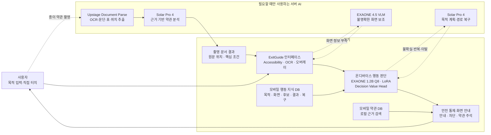

# ExitGuide AI

> 사용자 목표 기반 판단 보조 온디바이스 AI

ExitGuide는 스마트폰 사용이 익숙하지 않거나 복잡한 약관을 이해하기 어려운 사용자를 위해, 원하는 기능까지 단계별로 안내하고 중요한 약관을 근거와 함께 설명하는 **온디바이스 중심 하이브리드 의사결정 보조 서비스**입니다.

AI가 휴대폰을 대신 조작하지 않습니다. 현재 화면에서 눌러야 할 위치와 이유를 표시하고, 사용자가 직접 누르면 달라진 화면을 다시 읽어 다음 단계를 안내합니다. 결제, 동의, 가입, 해지·탈퇴 확정과 개인정보 제출처럼 결과가 중요한 단계에서는 안내를 멈추고 최종 결정을 사용자에게 맡깁니다.

- 팀: **ExitGuideLab**
- 국내 AI: **LG AI연구원 EXAONE**, **Upstage Solar·Document Parse**
- 시연 기기: **Galaxy S25+**
- 시연 영상: [YouTube](https://youtu.be/8YB3jl2YKNQ?si=f5ZpqoWffAoT5hZr) · [저장소 내 MVP 영상](MVP.mp4)

## 해결하려는 문제

가입, 결제, 구독 변경과 해지 같은 모바일 절차는 메뉴가 깊고 화면이 자주 바뀝니다. 비용, 자동 갱신, 환불과 개인정보 조건은 작은 문구나 긴 약관 속에 흩어져 있어, 사용자가 원래 목적과 다른 선택을 하도록 유도되기도 합니다. 종이 계약서와 신청서 역시 핵심 조건과 원문 위치를 한눈에 확인하기 어렵습니다.

기존 서비스는 화면 읽기, 모바일 자동 조작, 약관 요약과 행동 안전 검증을 개별적으로 제공합니다. ExitGuide는 다음 기능을 하나의 사용자 흐름으로 연결합니다.

1. 사용자의 자연어 목적을 이해합니다.
2. 현재 화면에 실제로 존재하는 행동 후보를 찾습니다.
3. 목적과 화면 문맥에 맞는 다음 후보를 비교합니다.
4. 누를 위치와 이유를 표시하고 사용자의 직접 입력을 기다립니다.
5. 행동 결과를 다시 관찰해 경로를 갱신하거나 오류를 복구합니다.
6. 앱 화면과 촬영 문서의 약관을 원문 근거와 함께 설명합니다.

## 핵심 기능

### 목적 기반 화면 안내

고정 좌표나 저장된 전체 경로를 재생하지 않습니다. 자연어 목적을 중간 목표와 최종 확인 단계로 바꾸고, 매 화면에서 행동 후보를 새로 비교합니다. 앱 업데이트나 팝업으로 UI가 달라져도 행동 후 화면을 다시 확인해 남은 경로를 조정합니다.

### 온디바이스 행동 판단

Android 접근성 서비스와 OCR로 화면의 문구, 버튼, 위치, 선택 상태와 계층 구조를 읽습니다. EXAONE 4.0 1.2B Q8, LoRA와 Decision Value Head가 사용자 목적에 맞는 후보를 상대 평가합니다. 모바일 행동 지식 DB는 정답을 대신 결정하는 고정 경로가 아니라, 화면 전이와 성공·실패·복구 경험을 판단 근거로 제공합니다.

### 오류 감지와 경로 복구

화면이 바뀌지 않거나 목표와 다른 곳으로 이동하면 같은 후보를 반복하지 않습니다. 현재 화면을 다시 관찰하고, 스크롤·뒤로 가기·다른 후보 선택 또는 경로 재계획으로 복구합니다. 화면 정보가 부족한 경우에만 EXAONE 4.5 VLM과 Solar Pro 4의 보조 판단을 사용합니다.

### 앱 화면 약관 분석

약관이나 동의 항목이 나타나면 Android에 탑재된 약관·소비자 사례 DB에서 관련 근거를 검색합니다. 비용, 계약 기간, 자동 결제, 해지, 환불과 개인정보 조건을 해당 문단 주변에 표시하며, 현재 화면과 검색 근거에서 확인되지 않은 내용은 생성하지 않습니다.

### 촬영 문서 분석

종이 계약서나 신청서를 촬영하면 Upstage Document Parse가 OCR, 문단·표 구조와 원문 위치를 추출합니다. Solar Pro 4는 약관 DB의 검색 근거를 바탕으로 비용, 계약 기간, 자동 갱신, 해지, 환불과 개인정보 조건을 정리하고, ExitGuide는 사진 속 해당 위치와 상세 결과를 연결해 보여 줍니다.

### 사용자 통제형 안전 설계

안내의 기본 형태는 **“여기를 누르세요”**라는 시각적 강조입니다. 결제, 동의, 가입, 해지·탈퇴 확정, 본인 인증, 비밀번호와 개인정보 제출은 민감 행동으로 분류합니다. 이 단계에서는 자동 실행과 추가 안내를 중단하고 선택의 결과와 주의사항만 설명합니다.

## 시스템 구성



일반적인 화면 판단과 약관 검색은 기기 내부에서 처리합니다. 서버는 불명확한 화면, 경로 복구와 촬영 문서 분석처럼 추가 추론이 필요한 상황에 선택적으로 사용합니다.

## AI 모델과 기술의 역할

| 구성 요소 | 역할 |
| --- | --- |
| EXAONE 4.0 1.2B Q8 | 정해진 목적, 현재 안내 단계와 화면의 행동 후보를 온디바이스에서 해석 |
| LoRA | 실기기에서 검증한 화면·행동 사례로 모바일 절차 이해를 보완 |
| Decision Value Head | 한 화면에 있는 후보들의 적합도를 상대 평가하고 우선순위를 결정 |
| EXAONE 4.5 33B | 접근성 정보가 부족한 화면의 시각 해석, 약관 데이터 검토와 보조 라벨 생성 |
| Solar Pro 4 | 자연어 목적과 중간 목표 계획, 경로 이탈 복구, 약관 근거 검증과 구조화된 설명 |
| Solar Embedding 2 | 약관 문단과 질의를 1,024차원 벡터로 변환해 의미 기반 검색 |
| Upstage Document Parse | 촬영 문서의 OCR, 문단·표 구조, 페이지와 원문 위치 추출 |

모델과 실행 도구는 구조화된 입출력으로 연결합니다. AI가 임의 좌표를 만들거나 화면에 없는 버튼을 실행하지 않도록, 현재 화면에서 관찰된 후보와 코드 기반 안전 규칙을 마지막 경계로 사용합니다.

## 데이터 구성

### 모바일 행동 지식 DB

AndroidControl, AMEX, GUI-Odyssey, LearnGUI, Uni-GUI/OpenMobile과 실기기 기록을 다음 공통 형식으로 정규화했습니다.

```text
사용자 목적 → 현재 화면 → 행동 후보 → 선택 행동 → 다음 화면 → 실행 결과 → 복구 경험
```

DB에는 앱별 좌표나 완성된 경로 대신 다음 정보가 저장됩니다.

- 목적 지식: 표준 목적, 유사 표현과 위험 등급
- 목적지 조건: 도달 화면의 필수·보조·금지 특징과 최종 행동
- 화면 상태: 화면 문구와 구조, 로그인 상태, Native·WebView 구분
- 행동 후보: 버튼 기능, 주변 문맥, 위치 범주와 위험도
- 행동 결과: 다음 화면, 목표 진행, 정체와 이탈 여부
- 복구 지식: 실패 원인, 반복 금지 후보, 복구 행동과 결과
- 검증 근거: 데이터 출처, 신뢰도, 앱 버전과 검증 이력

| 데이터 | 규모 |
| --- | ---: |
| AndroidControl 정규화 행동 단계 | 83,848개 |
| LoRA용 후보 행동 | 4,828건 |
| 화면 전이 자료 | 10,537건 |
| Decision Value Head 후보 비교쌍 | 22,912개 |

### 약관 지식 DB

공공 표준약관, 소비자 분쟁 사례와 공개 개인정보 약관을 정제했습니다. Android에는 **76,813개 근거와 SQLite FTS5 검색기**를 탑재합니다. 서버 연구 DB는 516,564개의 문단·가이드 레코드와 517,052개의 검색 청크로 구성했으며, 381,758개 고유 문단의 1,024차원 임베딩을 구축했습니다.

이 수치는 검색 인프라의 규모이며 답변 정확도를 의미하지 않습니다. 약관 설명은 항상 현재 화면 또는 촬영 원문과 검색 근거의 충분성을 별도로 확인합니다.

## 구현 및 검증 결과

아래 수치는 **2026년 8월 14일 본선 제안서 제출 시점**의 고정 평가 결과입니다. 학습 데이터 정확도, 후보 순위 정확도, 실기기 행동 정확도, 목표 화면 도달률과 약관 분석 정확도는 서로 다른 평가 단위이므로 구분해 제시합니다.

| 검증 항목 | 결과 |
| --- | ---: |
| 실기기 검증 범위 | 31개 앱 · 155개 시나리오 |
| Android 화면 처리·안전 기능 자동 테스트 | 227/227 통과 |
| LoRA 학습 데이터 정확도 | 483/549 · 88.0% |
| Value Head 후보 순위 정확도 | 384/446 · 86.1% |
| 실기기 올바른 행동 후보 선택률 | 521/615 · 84.7% |
| 최종 확인 화면 도달률 | 137/155 · 88.4% |
| 오류 발생 후 경로 복귀율 | 39/40 · 97.5% |
| 사용자 확인 없는 최종 행동 | 0건 |
| 화면 약관 근거 일치율 | 41/50 · 82.0% |
| 촬영 약관 분석 정확도 | 38/50 · 76.0% |
| 촬영 약관 평균 처리 시간 | 4.2초 |
| 온디바이스 판단 시간 | 평균 8.0초 이하 · p95 15.0초 이하 |
| 최대 메모리 사용량 | 2,650MB |

검증 앱에는 Instagram, YouTube, Netflix, 제주항공, X, 쿠팡, 배달의민족, ChatGPT, TVING, 왓챠, Wavve, Melon, FLO, 지니뮤직, 리디, 클래스101, 요기요, 듀오링고, G마켓, NAVER, NOL, TikTok 등이 포함됩니다.

제안서 제출 시점의 종합 진척도는 80%입니다. 목적·화면 인식 85%, 온디바이스 행동 판단 75%, 화면 안내 85%, 앱 약관 분석·주석 85%, 촬영 약관 분석 80%, 최종 단계 정지·오류 복구 90%로 평가했습니다. 이후 변경된 구현 상태와 별도 실험 결과는 [현재 프로젝트 현황](docs/CURRENT_PROJECT_STATUS.md)에서 관리합니다.

## 안전·신뢰 원칙

- AI는 화면을 직접 조작하지 않고 눌러야 할 위치와 이유를 표시합니다.
- 결제, 동의, 가입, 해지·탈퇴 확정, 본인 인증과 개인정보 제출 단계에서는 코드 규칙으로 안내를 중단합니다.
- 현재 화면에 실제로 존재하는 후보만 평가하며 임의 좌표와 존재하지 않는 후보 ID를 허용하지 않습니다.
- 행동 후 화면을 재관찰하고, 무변화·반복·경로 이탈이 발생하면 같은 후보를 반복하지 않습니다.
- 약관은 화면 원문과 DB 검색 근거에서 확인된 내용만 설명합니다. 다른 서비스의 조항이 섞이거나 근거가 부족하면 답변을 보류합니다.
- 일반 판단과 약관 검색은 기기 내부에서 처리합니다. 촬영 문서나 정밀 화면 분석을 서버로 보낼 때는 필요한 정보만 전송합니다.
- `.env`, 원본 스크린샷, 계정 정보와 로컬 런타임 DB는 Git에 포함하지 않습니다.

## 시연 시나리오

1. **YouTube Premium 해지**: 현재 화면의 후보를 비교해 누를 위치를 단계별로 표시하고, 최종 해지 버튼 앞에서 안내를 중단합니다.
2. **X 구독제 변경과 약관 설명**: 구독 관리 화면까지 안내하고 요금, 자동 갱신과 환불 조건을 해당 약관 문단 옆에 표시합니다.
3. **부동산 계약서 촬영 분석**: 문단, 표와 원문 위치를 추출하고 보증금, 계약 기간, 해지, 위약 사항과 특약을 사진 속 근거와 연결합니다.

- [본선 시연 영상 보기](https://youtu.be/8YB3jl2YKNQ?si=f5ZpqoWffAoT5hZr)
- [저장소 내 MVP 영상 보기](MVP.mp4)
- Windows MVP: [`dist/EGL-Navigation-MVP.exe`](dist/EGL-Navigation-MVP.exe)

## 저장소 구조

```text
exitguide-navigation/
├─ apps/
│  ├─ api/                     # 목적 계획, 행동 판단, 약관 검색, 복구와 안전 API
│  ├─ mobile/                  # Android 앱, AccessibilityService, OCR와 오버레이
│  └─ web-demo/                # 브라우저 기반 데모
├─ contracts/                  # Navigation·Terms 통합 입출력 계약
├─ data/                       # 경로·평가 데이터와 템플릿
├─ deploy/                     # 서버와 공개 APK 배포 설정
├─ fixtures/
│  └─ navigation/              # 기능 카탈로그, Gold, 평가·회귀 자료
├─ scripts/                    # 빌드, 수집, 검증, 학습·평가와 배포 자동화
├─ docs/                       # 아키텍처, 정책, 테스트와 연구 기록
├─ dist/                       # MVP 실행 파일
└─ MVP.mp4                     # MVP 시연 영상
```

## 빠른 시작

로컬 `.env`는 [`.env.example`](.env.example)을 복사해 사용합니다. 실제 API 키와 Endpoint ID가 들어 있는 `.env`는 Git에 포함하지 않습니다.

### 백엔드

```powershell
cd apps\api
python -m venv .venv
.\.venv\Scripts\pip.exe install -r requirements.txt
.\.venv\Scripts\python.exe -m uvicorn app.main:app --reload --port 8010
```

### 모바일 앱

```powershell
cd apps\mobile
npm ci
npm run typecheck
```

### Android 로컬 빌드와 설치

```powershell
.\scripts\Build-AndroidLocal.ps1
```

### 기본 회귀 검사

```powershell
.\scripts\Test-ApiUnit.ps1
.\scripts\Test-NavigationDbGym.ps1 -Mode fast
```

## 주요 문서

- [현재 프로젝트 현황](docs/CURRENT_PROJECT_STATUS.md)
- [시스템 아키텍처](docs/ARCHITECTURE.md)
- [Navigation Agent 학습 아키텍처](docs/NAVIGATION_AGENT_LEARNING_ARCHITECTURE.md)
- [범용 Navigation Agent](docs/UNIVERSAL_NAVIGATION_AGENT.md)
- [Navigation DB Gym](docs/NAVIGATION_DB_GYM.md)
- [AndroidControl 연동](docs/ANDROID_CONTROL.md)
- [API 계약](docs/API_CONTRACT.md)
- [실기기 Human Gold 기록](docs/GOLD_RECORDING.md)
- [휴대폰 테스트](docs/PHONE_TESTING.md)
- [공개 APK 배포](docs/PUBLIC_APK_DEPLOYMENT.md)
- [Navigation Agent 평가 보고서](docs/NAVIGATION_AGENT_EVALUATION.md)
- [개발 로그](docs/DEVELOPMENT_LOG.md)

## 다음 단계

- 검증 범위를 100개 앱과 별도 홀드아웃 앱으로 확대
- 여러 Android 기기에서 Q8·Value Head 후보 순위 편차와 성능 경계 검증
- STT·TTS 기반 음성 목적 입력과 단계별 음성 안내
- 촬영 약관의 문서 인식·근거 연결 성능 개선
- 복지관, 디지털 교육기관과 대학에서 고령층·디지털 취약계층 대상 시범 운영
- 기관별 행동 지식 팩과 약관 DB를 SDK 형태로 제공하는 B2B·B2G 확장

ExitGuide의 목표는 사용자의 결정을 대신하는 자동화가 아니라, 사용자가 이동 경로와 선택의 의미를 이해한 상태에서 복잡한 모바일 절차를 직접 수행하도록 돕는 것입니다.
