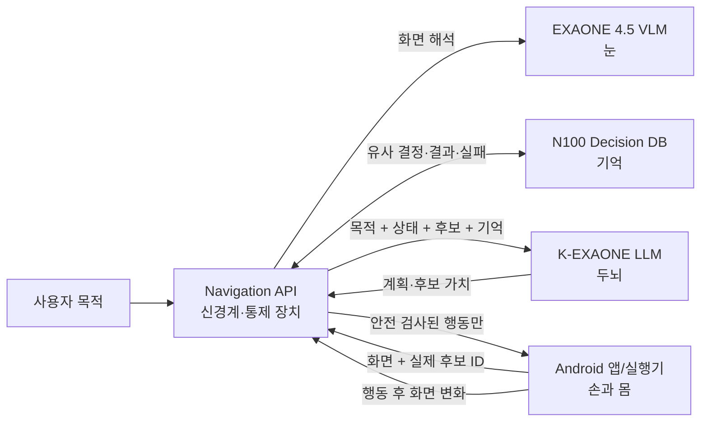
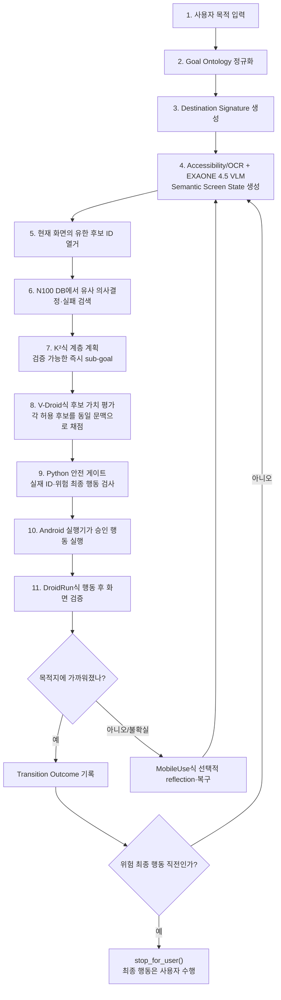

# ExitGuide Navigation DB Redesign

기존 앱별 완성 경로·대형 기능 카탈로그 방식과 분리한 Navigation Agent 실험이다. 이 저장소의 런타임은 **현재 화면에서 발견된 후보만** 다루며, 과거의 화면별 의사결정 결과를 검색해 다음 행동을 선택한다. 앱 이름으로 경로를 재생하거나 임의 좌표를 생성하지 않는다.

## 시스템을 한눈에 보기

> **EXAONE 4.5 VLM = 눈** — 화면 전체 의미, 아이콘, 영역, 주변 문맥을 해석
>
> **K-EXAONE LLM = 두뇌** — 목적과 현재 상태를 바탕으로 다음 행동을 계획
>
> **N100 신규 DB = 기억** — 과거의 유사 화면·후보·선택·결과·실패 경험을 검색하고 축적
>
> **Navigation API = 신경계 및 통제 장치** — 눈·두뇌·기억을 연결하고, 후보 ID 제한과 위험 행동 차단을 담당
>
> **Android 앱/실행기 = 손과 몸** — 승인된 클릭·스크롤·뒤로가기만 실제 실행



## N100에 구축된 현재 DB

Canonical SQLite: `/home/kyle/exitguide/imports/yanggeon/20260802-navigation-db-redesign/output/navigation-decision-v1.sqlite`

| 계층 | 테이블 | 현재 행 수 | 역할 |
|---|---|---:|---|
| Goal Ontology | `goals`, `goal_phrases`, `goal_relations` | 6 / 41 / 4 | 한국어 목적을 회원가입·회원탈퇴·멤버십 목적과 조건으로 정규화 |
| Destination Signature | `destination_signatures` | 6 | 화면 전체 의미 특징으로 목적지 판정 |
| Semantic Screen State | `semantic_screens`, `screen_observations` | 73 / 73 | 앱·좌표 독립 화면 상태와 Accessibility/OCR/VLM 관찰 |
| Affordance Memory | `affordance_roles`, `affordance_role_aliases`, `affordances` | 14 / 76 / 1,525 | 화면에 실제 존재한 전체 후보와 기능 역할 |
| Transition Outcome | `decision_cases`, `transition_outcomes` | 74 / 74 | 한 화면에서 한 후보를 선택한 결과와 목적지 거리 변화 |
| Failure & Recovery | `recovery_memories` | 11 | 금지 후보, 반복 실패와 안전 복구 행동 |
| Evidence & Confidence | `evidence_records` | 222 | Human Gold·실기기·합성·모델 추론의 출처와 신뢰도 |
| Leakage Control | `evaluation_app_splits` | 8 | 앱 단위 train/validation/test 분리 |

DB 파일 크기는 1,912,832 bytes이고 schema version은 1이다. 기존 대형 AndroidControl 색인, 앱별 Gold 매크로, 전체 기능 카탈로그, Terms RAG는 이 실험의 런타임 의존성이 아니다. Human Gold는 화면별 고신뢰 의사결정 사례로 분해된 결과만 사용한다.

상세 스키마와 인덱스는 [Navigation Decision DB 설계](docs/NAVIGATION_DECISION_DB_V1.md), SQL은 [navigation_decision_v1.sql](db/navigation_decision_v1.sql)에서 확인할 수 있다.

## 최종 Navigation Agent 흐름



허용 행동은 `click(candidate_id)`, `scroll(direction)`, `back()`, `wait_and_observe()`, `stop_for_user()`뿐이다. `click`은 관찰된 후보 ID가 아니면 안전 행동으로 대체되고, 결제·탈퇴 확정·해지 확정·개인정보 제출은 항상 `stop_for_user()`로 전환된다. 연결 오류는 UI 탐색 실패와 별도 상태로 저장한다.

## AndroidWorld 상위 연구를 적용한 위치

- K²-Agent: 상위 목적을 즉시 검증 가능한 sub-goal과 기대 결과로 분해한다.
- V-Droid: 모델이 좌표를 생성하지 않고, 현재 화면에서 열거된 후보 각각의 가치를 검증한다.
- DroidRun/Mobilerun: 실행 성공 여부를 다음 화면 관찰로 판정하고 공유 상태와 Transition Outcome에 기록한다.
- MobileUse: 매 단계가 아니라 낮은 신뢰도·반복·무변화·역행 시에만 action/trajectory/global reflection을 호출한다.

논문의 벤치마크 데이터나 학습 가중치를 복제했다고 주장하지 않는다. 구조와 입출력 경계를 가져와 K-EXAONE·EXAONE 4.5·N100 DB에 맞게 구현했다. 근거, 구현 대응표, 아직 검증하지 못한 부분은 [AndroidWorld 연구 기반 아키텍처](docs/ANDROIDWORLD_RESEARCH_ARCHITECTURE.md)에 정리돼 있다.

## 코드 구성

```text
apps/api/app/navigation_main.py                 FastAPI 진입점
apps/api/app/navigation_contracts.py            후보·행동·관찰 계약
apps/api/app/services/navigation_decision_memory.py  신규 DB Retriever
apps/api/app/services/navigation_research_policy.py  계층 계획·후보 검증·선택적 복구
apps/api/app/services/navigation_model_clients.py    K-EXAONE / EXAONE 4.5 어댑터
apps/api/app/services/navigation_runtime.py          결정→실행 후 검증 흐름
apps/api/app/services/navigation_runtime_store.py    승격 전 append-only 경험 저장
db/navigation_decision_v1.sql                   검증된 기억 스키마
db/navigation_runtime_v1.sql                    런타임 관찰 스키마
scripts/Migrate-NavigationDecisionDb.py         기존 기록의 결정 단위 변환기
scripts/Evaluate-NavigationRuntimeOffline.py    앱 분리 오프라인 A/B 평가기
```

API 계약은 [Navigation API v1](docs/NAVIGATION_API_V1.md)에 있다.

## 로컬 검증

```bash
python -m pip install -r apps/api/requirements.txt
python apps/api/tests/navigation_decision_memory_unit.py
python apps/api/tests/navigation_research_architecture_unit.py
python apps/api/tests/navigation_runtime_unit.py
```

실기기 테스트 전 단계에서는 모델 미연결 fallback과 기록된 화면으로 계약·안전성만 검증한다. 실제 성공률 개선 여부는 앱 단위 완전 분리 A/B 평가와 실기기 검증 전에는 확정하지 않는다.

## 현재 결과에 대한 냉정한 결론

74개 변환 사례를 source app 제외 방식으로 다시 재생한 진단 결과는 첫 행동 0.7778, 전체 positive next-action exact match 0.4444, 기록된 실패 클릭 회피 0.8182, 위험 행동 자동 클릭 0건이었다. 이는 **최종 A/B가 아니라 runtime 방향성 검사**다. 전체 다음 행동 정확도 44.44%는 아직 낮고 기존 방식보다 개선됐다고 말할 근거도 없다. 따라서 정적 데이터를 더 쌓지 않고, 실제 K-EXAONE/EXAONE 4.5 endpoint를 연결한 앱 분리 A/B와 실패 지점 분석을 먼저 수행한다.
