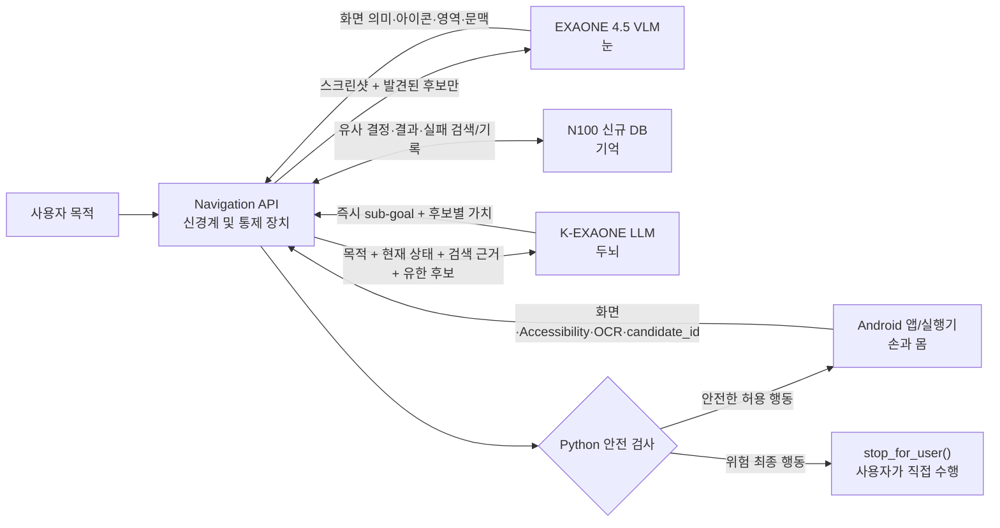
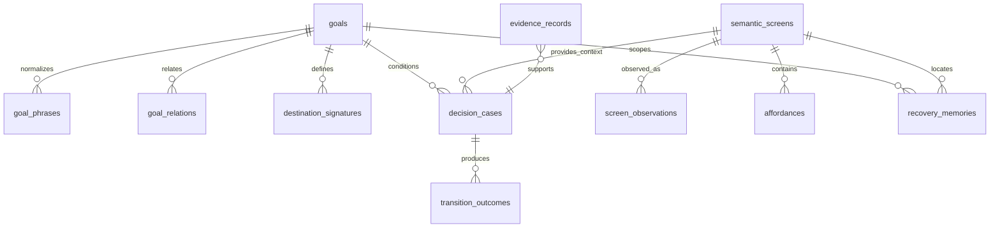
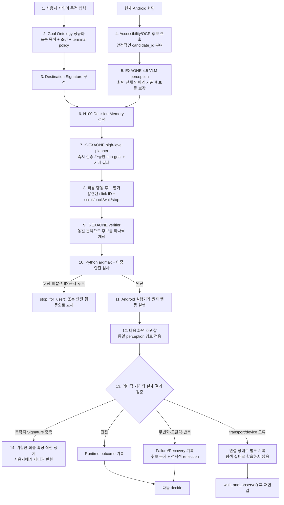

# AndroidWorld 연구 기반 Navigation Agent 설계

작성 기준일: 2026-08-02

이 문서는 AndroidWorld 벤치 데이터나 테스트 앱을 ExitGuide DB로 가져오기 위한 문서가
아니다. AndroidWorld에서 검증된 Agent 구조를 ExitGuide의 제한된 행동 공간과 안전
정책에 맞게 옮기기 위한 구현 명세다.

## 시스템을 한 문장으로 이해하기

> **EXAONE 4.5 VLM = 눈** — 화면 전체 의미, 아이콘, 영역, 주변 문맥을 해석
>
> **K-EXAONE LLM = 두뇌** — 목적과 현재 상태를 바탕으로 다음 행동을 계획
>
> **N100 신규 DB = 기억** — 과거의 유사 화면·후보·선택·결과·실패 경험을 검색하고 축적
>
> **Navigation API = 신경계 및 통제 장치** — 눈·두뇌·기억을 연결하고, 후보 ID 제한과 위험 행동 차단을 담당
>
> **Android 앱/실행기 = 손과 몸** — 승인된 클릭·스크롤·뒤로가기만 실제 실행

이 다섯 요소는 서로 대체 관계가 아니다. VLM과 LLM은 매 단계 바뀌는 화면을 해석하고
판단하며, DB는 과거 경험을 근거로 제공한다. Navigation API는 모델의 판단을 실제 기기
명령으로 바로 전달하지 않고 후보 제한·안전 검사·결과 검증을 거친다.

## 현재 N100 Navigation DB

2026-08-02에 N100의 canonical SQLite를 읽기 전용으로 확인한 값이다. 이 DB는 기존
Terms RAG 벡터 DB, 기존 외부 행동 예시 DB, 앱별 Gold 경로 DB와 별개다.

| 항목 | 현재 값 |
|---|---:|
| 파일 크기 | 1,912,832 bytes |
| 표준 목표 / 자연어 목적 문구 | 6 / 41 |
| Destination Signature | 6 |
| Affordance role / alias | 14 / 76 |
| Semantic screen / observation | 73 / 73 |
| 화면 후보 Affordance | 1,525 |
| Decision case / Transition outcome | 74 / 74 |
| Recovery memory | 11 |
| Evidence record | 222 |
| 평가 앱 split | 8 |

목표 6개는 모든 문장을 미리 나열한 전체 자연어 사전이 아니다. `goal_phrases`의 동의어와
조건을 통해 자연어를 표준 목표로 정규화하고, 새로운 목적은 ontology migration으로
확장한다. 현재 프로토타입의 중심 범위는 회원가입·회원탈퇴·멤버십 가입/변경/해지다.

### 검증된 Decision Memory

| 계층 | 주요 테이블 | 저장하는 것 |
|---|---|---|
| Goal Ontology | `goals`, `goal_phrases`, `goal_relations` | 표준 목적, 동의 표현, 반대·관련 목적, 위험한 최종 행동 정책 |
| Destination Signature | `destination_signatures` | 목적지 화면의 필수·선택·금지·terminal 의미 특징과 임계값 |
| Semantic Screen State | `semantic_screens`, `screen_observations` | 앱/좌표 독립 화면 fingerprint와 실제 앱 버전·locale 관찰 출처 |
| Affordance Memory | `affordance_roles`, `affordance_role_aliases`, `affordances` | 텍스트·아이콘·주변 문구·부모 문맥·위치와 기능 역할 |
| Decision Experience | `decision_cases`, `transition_outcomes` | 특정 목적·화면·전체 후보에서 선택한 행동과 행동 후 결과 |
| Failure and Recovery | `recovery_memories` | 실패 signature, 금지 후보, 복구 행동과 복구 성공 여부 |
| Evidence and Confidence | `evidence_records` | Human Gold·실기기·합성·모델 추론 출처, 신뢰도, 검증 횟수·일자 |
| Leakage Control | `evaluation_app_splits`, `retrieval_events` | 앱 단위 train/dev/holdout 분리와 검색 추적 |

### 승격 전 Runtime Memory

Navigation API는 검증된 Decision DB를 읽기 전용으로 사용한다. 실행 중 새로 생기는
경험은 별도 Runtime SQLite에 다음과 같이 기록한다.

- `navigation_sessions`: 목적과 앱·locale을 가진 탐색 세션
- `navigation_decisions`: sub-goal, 전체 후보 점수, 선택 행동, 안전 검사 결과
- `navigation_observations`: 연결 상태, 다음 화면, 목적지 거리 변화, 실패 유형
- `navigation_recovery_memory`: 같은 세션·화면에서 반복하면 안 되는 후보와 복구 행동
- `navigation_knowledge_revision_queue`: K²식 첫 실패 지점과 Add/Delete/Update/Highlight 제안

Runtime 기록은 Human 검토나 앱 분리 오프라인 리플레이를 통과하기 전에는 Decision DB로
자동 승격하지 않는다. 모델의 잘못된 선택이 자신의 다음 검색 근거로 강화되는 것을 막기
위한 경계다.

## 확인한 1차 자료

1. K²-Agent 논문: https://arxiv.org/abs/2603.00676
2. V-Droid 논문: https://arxiv.org/abs/2503.15937
3. V-Droid 공식 코드: https://github.com/V-Droid-Agent/V-Droid
   - 확인 commit: `8d549027634abe65a5721fe6bc3b5e84475db2f6`
4. MobileUse 논문: https://arxiv.org/abs/2507.16853
5. MobileUse 공식 코드: https://github.com/MadeAgents/mobile-use
   - 확인 commit: `babec07fd0e5faa7e7bcc7d3d0ee2320f6b83347`
6. DroidRun/Mobilerun 공식 코드: https://github.com/droidrun/mobilerun
   - 확인 commit: `ab55496d4f5d91899c831dc533e29b85f9e93bdf`
7. AndroidWorld 공식 환경: https://github.com/google-research/android_world

## 연구에서 그대로 가져오는 원칙

### K²-Agent: know-what와 know-how 분리

K²-Agent는 상위 Planner가 전체 작업을 즉시 실행 가능한 한 단계 sub-goal로 바꾸고,
하위 Executor가 현재 화면에서 원자 행동을 수행한다. 실행 결과가 예상과 다르면
`Summarize → Reflect → Locate → Revise` 순환으로 첫 실패 지점을 찾아 선언적 지식을
국소 수정한다.

ExitGuide 대응:

- know-what: Goal Ontology, Destination Signature, 검색된 decision cases
- 즉시 sub-goal: `프로필/계정 허브를 찾는다`처럼 한 화면에서 검증 가능한 목표
- know-how: 현재 화면의 실제 후보 중 다음 행동 선택
- Verify: 행동 전후 Semantic Screen State와 Destination Signature 변화
- Locate/Revise: 첫 불일치 decision과 실패 후보를 runtime memory에 격리 기록

K²의 C-GRPO 학습은 이번 N100 프로토타입에 포함하지 않는다. 논문 구현은 대규모 GPU
훈련을 전제로 하므로, 현재는 비모수 DB 기억과 K-EXAONE planner/executor 경계만
구현한다. 이를 K² 전체 재현이라고 부르지 않는다.

### V-Droid: 생성기가 아닌 후보 verifier

V-Droid는 UI에서 유한한 행동 후보를 먼저 열거하고, 각 후보에 동일한 목표·화면·작업
기억을 붙여 `이 행동이 목표 달성에 도움이 되는가`를 개별 검증·채점한 후 최고 점수를
실행한다. 공식 코드는 후보별 prompt를 만들고 batch verifier score의 최댓값을 고른다.

ExitGuide 대응:

- 클릭 후보는 Accessibility/OCR/VLM 단계에서 실제 발견된 `candidate_id`만 사용
- 기본 후보는 `scroll`, `back`, `wait_and_observe`, `stop_for_user`
- 좌표 후보, 임의 텍스트 입력, 앱별 정답 경로는 생성하지 않음
- K-EXAONE은 직접 좌표나 임의 행동을 생성하지 않고 각 허용 후보의 도움 가능성을 채점
- Hermes tool call은 semantic sub-goal 제출과 단일 후보 점수 제출에만 사용
- DB 점수는 prior이며 K-EXAONE verifier 점수와 출처를 분리
- 위험 후보는 verifier 호출 전 Python이 차단하고 최종 선택 후 다시 검사

V-Droid의 8B verifier 가중치와 P³ pairwise 학습은 이번 단계에서 그대로 사용하지
않는다. 대신 동일한 verifier 입출력 계약을 K-EXAONE에 적용하고, 향후 실제 결과로
positive/negative action pair를 축적할 수 있게 한다.

### MobileUse: Reflection-on-Demand

MobileUse는 모든 단계에서 무조건 reflection하지 않는다. 낮은 행동 신뢰도일 때
action reflection을 켜며, 최근 3~5단계에서 반복 행동·반복 화면·누적 오류가 나타날 때
trajectory reflection을 켠다. 종료 시에는 global reflection으로 완료 여부를 재검증한다.

ExitGuide 대응:

- Action trigger: 낮은 verifier margin, 실행 실패, 화면 무변화, 예상 결과 불일치
- Trajectory trigger: 같은 화면/행동 반복 또는 최근 5단계에서 오류 2회 이상
- Global trigger: Destination Signature 충족 또는 `stop_for_user` 직전
- 고신뢰 정상 이동에서는 추가 VLM 호출을 생략
- reflection 결과는 다음 계획의 피드백이지 직접 실행 명령이 아님

### DroidRun/Mobilerun: 관찰된 결과를 공유 상태로 승격

공식 구현은 manager와 executor를 분리하고, 현재/이전 device state, 최근 action outcome,
error description, progress summary를 공유 상태에 둔다. Executor의 도구 실행 성공 여부를
명시적으로 Manager에 되돌린다.

ExitGuide 대응:

- `decide`와 `observe`를 분리
- 실행 성공과 의미적 화면 진전을 별도 필드로 기록
- 연결 오류에는 next screen을 만들지 않음
- 다음 결정에는 최근 행동·관찰·오류·progress summary만 제한적으로 전달

## 목표로 하는 최종 Navigation Agent 흐름

### API와 실행기 사이의 계약

- `POST /v1/navigation/decide`: 현재 화면을 바탕으로 안전한 다음 행동 하나를 반환
- `POST /v1/navigation/observe`: 그 행동의 실제 실행 결과와 다음 화면을 기록·검증
- K-EXAONE Hermes 함수는 `submit_navigation_subgoal`,
  `score_navigation_candidate`만 허용
- 실행 가능 행동은 `click(candidate_id)`, `scroll(direction)`, `back()`,
  `wait_and_observe()`, `stop_for_user()`로 제한
- 모델에는 좌표 필드가 없고 입력 화면에 없던 candidate ID는 Python이 거부
- 탈퇴 확정·해지 확정·결제·구매·개인정보 제출은 항상 `stop_for_user()`

### 구현과 아직 검증되지 않은 것

현재 Python/FastAPI Navigation API, K-EXAONE·EXAONE 4.5 어댑터, Runtime DB와 안전
계약 테스트까지 구현돼 있다. 논문의 학습법인 K² C-GRPO와 V-Droid P³ 가중치를 재현한
것은 아니다. 실제 모델 endpoint를 사용한 앱 분리 A/B, 실기기 성공률, APK 실행기 연결은
후속 검증 대상이며 그 전에는 기존 방식보다 성능이 높다고 주장하지 않는다.

74개 변환 사례의 source-app 제외 진단 재생에서는 첫 행동 정확도 0.7778, positive
next-action exact match 0.4444, 실패 클릭 회피율 0.8182, 위험 행동 자동 클릭 0건이었다.
이 수치는 모델 endpoint가 없는 fallback의 방향성 검사이며 최종 A/B가 아니다. 특히 전체
다음 행동 정확도는 낮으므로 데이터를 더 늘릴 근거가 되지 않는다.

## 반드시 구분할 것

- AndroidWorld 성공률을 ExitGuide의 예상 성능으로 인용하지 않는다.
- 논문 구조를 적용한 것과 논문의 학습된 모델을 재현한 것을 구분한다.
- DB prior만으로 후보를 고른 결과를 V-Droid verifier 결과라고 부르지 않는다.
- 저신뢰 runtime 기록은 검증된 decision memory로 자동 승격하지 않는다.
- 앱 이름은 평가 분리와 출처 추적에만 쓰고 모델 prompt와 경로 정책에는 넣지 않는다.
