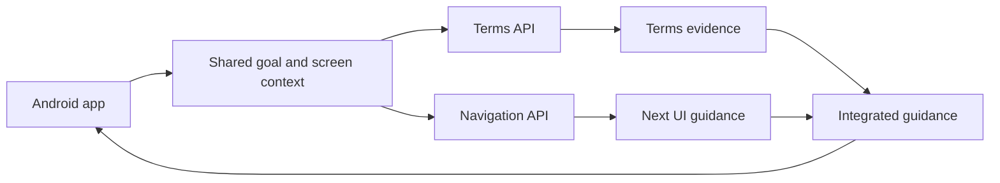

# Architecture

## 1. Overview

ExitGuide AI uses a mobile client with independently developed Terms and Navigation modules.

The repositories stay independent. This repository owns Terms and final integration. `exitguide-navigation` owns Android screen navigation and route recovery. Shared goal IDs live in `contracts/goals.v1.json`; see `docs/TEAM_ARCHITECTURE.md` for ownership and integration rules.

## 2. Mobile App

Recommended stack:

- React Native
- Expo
- TypeScript
- EAS Build for APK generation

Responsibilities:

- Goal selection
- Screenshot picking/upload
- Analysis status
- Result card rendering
- Proof Card display and later export
- API-backed goal/demo catalog with offline fallback
- Local analysis history on the device for demo comparison

First MVP screens:

- Home and goal selection
- Screenshot upload
- Analysis loading
- Result details
- Proof Card

## 3. API

Recommended stack:

- Python
- FastAPI
- Pydantic
- Uvicorn

Responsibilities:

- Receive multipart screenshot uploads
- Normalize goal IDs
- Call OCR provider
- Call LLM provider with controlled JSON schema
- Run deterministic rule checks
- Return one canonical analysis response
- Combine deterministic demo screens through `/v1/analyze/flow` for later multi-screen flow analysis experiments

Routes are grouped under `app/routers`:

- `ops.py`: health, provider status, readiness, and demo-quality gates
- `catalog.py`: goals, deterministic scenarios, flows, collection records, and synthetic fixture metadata
- `terms.py`: terms corpus, local retrieval baseline, and corpus quality
- `analysis.py`: prompt preview, single-screen analysis, and flow analysis

## 4. Provider Boundaries

Providers must be swappable.

- `mock`: deterministic local fixture response
- `naver_clova_ocr`: OCR for Korean screenshots
- `hyperclova`: Korean LLM reasoning
- `upstage`: backup LLM reasoning

The early MVP should keep provider interfaces stable and use mock providers until keys are available.

Current implementation already separates the mock OCR provider, mock LLM provider, and rule engine. Real providers should implement the same boundaries instead of changing the mobile contract.
Provider setup details live in `docs/PROVIDERS.md`.

The API also exposes provider readiness notes through `/v1/status` so the mobile app can show whether it is using deterministic mock providers or configured real providers.

## 5. Rule Engine Signals

Initial signals:

- Monetary impact
- Default selected checkbox
- Button prominence
- Goal-opposing wording
- Repeated retention prompt
- Ambiguous cancellation wording

The rule engine should not replace the LLM. It validates and adjusts model output so the service feels controlled and explainable.

## 6. Data Storage

Phase 1:

- No persistent user accounts
- Store nothing by default
- Keep optional local demo fixtures

Phase 2:

- SQLite for demo analysis history
- Postgres-ready repository boundary if backend persistence becomes needed

## 7. Security And Safety

- Do not upload real screenshots unless the user explicitly chooses them.
- Do not log raw image content in production mode.
- Avoid legal conclusions.
- Avoid automatic control of other apps in MVP.
- Use synthetic UI images for contest demos.
