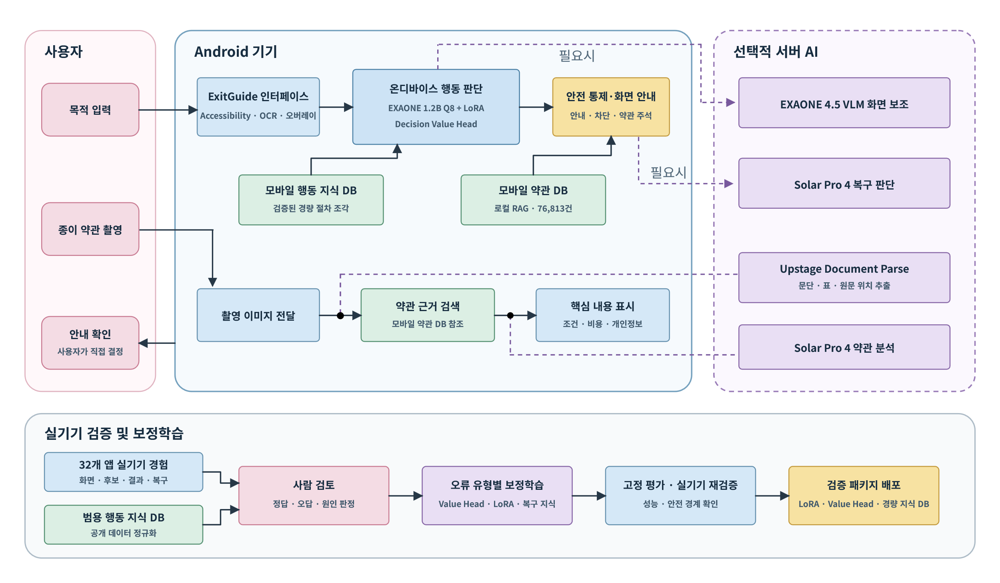

# ExitGuide AI 통합 기술 보고서

> 사용자 목표 기반 판단 보조 온디바이스 AI

- 기준 문서: 2026년도 인공지능 루키 본선 제안서
- 고정 기준일: 2026년 8월 14일
- 팀: ExitGuideLab
- 지원 트랙: 국내 AI 트랙
- 연계 기술: LG AI연구원 EXAONE, Upstage Solar·Document Parse

이 보고서는 ExitGuide의 문제 정의, 사용자 경험, 시스템 아키텍처, 모델과 데이터, 내비게이션·약관 처리 과정, 구현 범위, 정량 평가와 한계를 하나의 공개 기술 문서로 통합한다.

> **주장 범위:** 이 문서의 수치와 진척도는 본선 제안서 제출 시점의 고정 결과다. 저장소의 최신 런타임 상태나 이후 실험 결과와 같다고 가정하지 않는다. 현재 `main`의 구현·수집 상태는 [CURRENT_PRIORITY.md](../CURRENT_PRIORITY.md), 재현 가능한 오프라인 평가 경계는 [OFFLINE_AB_EVALUATION.md](OFFLINE_AB_EVALUATION.md)에서 별도로 관리한다.

> **저장소 범위:** 현재 `main`은 Navigation Decision API, Android Executor, Decision/Runtime DB와 검증·승격 파이프라인을 담은 연구·실행 슬라이스다. 약관 RAG, 촬영 문서 분석과 온디바이스 통합 APK는 본선 제안서의 통합 제품 범위다. 이 보고서는 두 범위를 함께 설명하되, 구현 여부를 혼동하지 않도록 **제안서 목표**와 **현재 `main` 구현**을 구분한다.

## 목차

1. [기술 요약](#1-기술-요약)
2. [사용자 경험](#2-사용자-경험)
3. [시스템 아키텍처](#3-시스템-아키텍처)
4. [AI 모델과 역할 분담](#4-ai-모델과-역할-분담)
5. [데이터와 지식 DB](#5-데이터와-지식-db)
6. [모바일 내비게이션 파이프라인](#6-모바일-내비게이션-파이프라인)
7. [약관 RAG와 촬영 문서 분석](#7-약관-rag와-촬영-문서-분석)
8. [구현 및 배포 구조](#8-구현-및-배포-구조)
9. [평가 설계와 결과](#9-평가-설계와-결과)
10. [안전·신뢰·윤리](#10-안전신뢰윤리)
11. [시연 구성](#11-시연-구성)
12. [한계와 확장 계획](#12-한계와-확장-계획)

# 1. 기술 요약

## 1.1 해결하려는 문제

스마트폰 서비스의 가입, 결제, 구독 변경과 해지 절차는 메뉴가 깊고 화면이 자주 바뀐다. 비용, 자동 결제일, 환불과 개인정보 조건은 작은 문구나 긴 약관 속에 흩어져 있어 고령층과 디지털 취약계층뿐 아니라 일반 사용자도 원래 목적과 다른 선택을 할 수 있다. 종이 계약서와 신청서도 핵심 조건과 원문 위치를 빠르게 확인하기 어렵다.

기존 기술은 다음 기능을 개별적으로 제공한다.

- 화면 읽기 또는 정해진 사용법 안내
- 모바일 에이전트의 절차 자동화
- 서비스 단위 약관 요약
- 에이전트 행동의 실행 전 안전 검증

그러나 복잡한 모바일 절차에서는 **어디로 이동해야 하는지**, **그 선택의 조건과 결과가 무엇인지**, **AI가 멈추고 사용자가 결정해야 하는 시점이 언제인지**를 하나의 흐름에서 지원해야 한다.

## 1.2 제안 기술

ExitGuide는 다음 여섯 기능을 결합한다.

1. 자연어 목적 분석과 중간 목표 계획
2. 현재 Android 화면 인식과 행동 후보 추출
3. 온디바이스 후보 비교와 우선순위 결정
4. 사용자 직접 터치 안내와 행동 결과 재관찰
5. 무변화·반복·경로 이탈 감지와 오류 복구
6. 앱 화면 및 촬영 문서의 약관 근거 검색·설명


**그림 1. ExitGuide 사용자 흐름과 기술 구성**

상단 흐름은 목적 기반 화면 안내를, 하단 흐름은 촬영 문서 분석을 나타낸다. 공통 원칙은 AI가 사용자 대신 최종 상태를 변경하지 않고 관찰, 판단, 설명과 시각 안내를 제공한다는 것이다.

## 1.3 설계 원칙

| 원칙 | 구현 의미 |
| --- | --- |
| 현재 화면 우선 | 저장된 좌표보다 현재 화면에서 관찰된 후보를 우선한다. |
| 사용자 직접 입력 | 누를 위치를 표시하고 사용자의 실제 터치를 기다린다. |
| 행동 후 재관찰 | 화면 변화를 확인한 뒤 다음 후보를 다시 판단한다. |
| 근거 기반 설명 | 약관은 원문과 검색 근거에서 확인된 내용만 설명한다. |
| 코드 기반 안전 경계 | 결제·동의·해지 확정과 개인정보 제출은 모델 판단과 별도로 차단한다. |
| 선택적 서버 사용 | 일반 판단은 로컬에서 처리하고 어려운 사례에만 서버 AI를 사용한다. |

# 2. 사용자 경험

## 2.1 목적 입력

<p align="center">
  
</p>

**그림 2. 자연어 목적 입력 화면**

사용자는 앱 이름이나 고정된 작업 목록을 먼저 선택하지 않고 자연어로 원하는 일을 입력할 수 있다. 목적은 표준 목표와 중간 단계, 최종 확인 조건으로 변환된다.

## 2.2 사용자 직접 터치 모드

<p align="center">
  
</p>

**그림 3. 사용자 직접 터치와 촬영 약관 진입 화면**

화면 안내의 권장 모드는 `내가 직접 누르기`다. ExitGuide는 버튼 위치와 이유를 표시하지만 실제 입력을 생성하지 않는다. 같은 화면에서 촬영 약관 분석으로 진입할 수 있다.

## 2.3 화면 위 위치 안내

<p align="center">
  
</p>

**그림 4. YouTube 화면의 누를 위치 안내**

Android 오버레이는 현재 단계의 후보를 테두리와 설명 카드로 강조한다. 사용자가 직접 누르면 변경된 화면을 다시 읽고 다음 단계를 갱신한다.

## 2.4 현재 화면 약관 설명

<p align="center">
  
</p>

**그림 5. X 구매자 이용약관 근거 표시**

약관 화면이 나타나면 비용, 자동 갱신, 해지와 환불 조건처럼 현재 선택에 직접 영향을 주는 항목을 원문 주변에 표시한다. 전체 약관을 대체하는 법률 판단이 아니라, 사용자가 선택 전에 확인할 핵심 조건과 원문 위치를 연결하는 기능이다.

# 3. 시스템 아키텍처



**그림 6. ExitGuide 통합 시스템 아키텍처**

시스템은 Android 기기 내부의 실시간 판단 경로와 선택적 서버 AI, 실기기 검증·보정학습 경로로 나뉜다.

> 그림 하단에는 개발 과정에서 확장된 `32개 앱 실기기 경험` 표기가 포함되어 있다. 본 보고서의 고정 정량 평가 분모는 제안서 3.3.1 표에 따라 **31개 앱, 155개 시나리오**로 통일한다. 그림의 표기는 구조 설명용이며 평가 분모로 사용하지 않는다.

## 3.1 Android 기기 내부

### ExitGuide 인터페이스

- 사용자의 자연어 목적 입력
- AccessibilityService 기반 화면 구조 수집
- OCR 기반 누락 문구 보완
- 화면 위 시각 안내와 약관 주석
- 조작 결과와 현재 단계 표시

### 온디바이스 행동 판단

- EXAONE 4.0 1.2B Q8
- 모바일 화면과 절차 이해를 보완하는 LoRA
- 한 화면의 후보를 상대 평가하는 Decision Value Head
- 목적, 현재 단계, 이전 행동과 후보 문맥을 함께 입력

### 로컬 지식과 안전 통제

- 모바일 행동 지식 DB
- 모바일 약관 DB와 SQLite FTS5 검색기
- 민감 행동 정지 규칙
- 반복 후보 제외와 경로 복구 정책

## 3.2 선택적 서버 AI

### EXAONE 4.5 33B

접근성 정보가 부족한 WebView·Canvas, 텍스트 없는 아이콘과 겹쳐진 팝업을 시각적으로 보완한다. 약관 데이터 품질 검토와 경량 모델용 보조 라벨 생성에도 사용한다.

### Solar Pro 4

사용자의 자연어 요청을 표준 목적과 중간 목표로 구성한다. 후보가 불명확하거나 화면이 반복되고 경로를 벗어났을 때 복구 판단을 지원한다. 약관 분석에서는 검색 근거의 충분성을 검사하고 구조화된 설명을 생성한다.

이는 본선 제안서의 통합 목표 구성이다. 현재 `main`의 [Navigation Decision API v1](NAVIGATION_API_V1.md)은 K²식 Planner와 후보 평가 엔진을 **Solar Pro 3**로 정의한다. 따라서 제안서 모델명과 현재 런타임 계약을 동일한 배포 상태로 해석하지 않는다.

### Upstage Document Parse

촬영 문서에서 OCR 결과, 문단과 표 구조, 페이지 및 원문 위치를 추출한다. 분석 결과가 원문의 어느 부분을 근거로 하는지 다시 연결할 수 있도록 위치 정보를 유지한다.

## 3.3 검증·보정학습 경로

실기기 기록과 공개 행동 자료는 사람이 정답, 오답과 원인을 검토한 뒤 오류 유형별로 반영한다.

```text
실기기·공개 행동 자료
        ↓
사람 검토: 정답 · 오답 · 오류 원인
        ↓
후보 순위 오류 → Decision Value Head
화면 의미 오류 → LoRA
반복·복구 실패 → 행동 지식 DB와 복구 정책
        ↓
고정 평가 · 실기기 재검증 · 성능 경계 확인
```

# 4. AI 모델과 역할 분담

## 4.1 모델별 역할

| 모델·기술 | 실행 위치 | 역할 | 사용 경계 |
| --- | --- | --- | --- |
| EXAONE 4.0 1.2B Q8 | Android | 목적·현재 단계·행동 후보의 의미 해석 | 현재 화면의 후보만 평가 |
| LoRA | Android 모델 어댑터 | 실기기 화면과 모바일 절차 이해 보완 | 화면 의미 오류 보정 |
| Decision Value Head | Android | 후보 적합도 상대 평가와 우선순위 결정 | 자동 실행 권한 없음 |
| EXAONE 4.5 33B | A100 서버 | 불명확한 화면의 VLM 보조, 데이터 검토 | 정보가 부족할 때 선택적으로 호출 |
| Solar Pro 4 | 서버 API | 목적 계획, 경로 복구, 근거 기반 약관 설명 | 일반 화면 판단을 대체하지 않음 |
| Solar Embedding 2 | 서버·연구 DB | 약관 문단과 질의의 1,024차원 임베딩 | 검색 후보 생성에 사용 |
| Upstage Document Parse | 서버 API | OCR, 문단·표 구조와 원문 위치 추출 | 촬영 문서에 사용 |

## 4.2 온디바이스 후보 판단

모델 입력은 단일 스크린샷이 아니라 다음 문맥을 구조화해 결합한다.

- 사용자의 표준 목적
- 현재 계획 단계와 최종 확인 조건
- 현재 화면의 문구와 계층 구조
- 화면에서 추출한 전체 행동 후보
- 후보의 역할, 주변 문맥, 위치 범주와 위험도
- 이전 행동과 행동 후 화면 변화
- 반복·정체·경로 이탈 상태

출력은 실행 좌표가 아니라 **현재 후보 중 무엇을 안내할지**, **왜 선택했는지**, **불확실한지**, **민감 행동인지**를 표현한다. 실제 안내 전에 코드 기반 안전 분류가 다시 적용된다.

## 4.3 서버 보조 조건

서버 AI는 항상 호출하지 않는다. 다음 조건에서만 선택적으로 사용한다.

- 접근성 정보와 OCR만으로 후보 의미를 구분하기 어려움
- 같은 후보나 화면이 반복됨
- 목적 경로에서 이탈했거나 적합한 후보가 없음
- 촬영 문서의 구조와 원문 위치를 추출해야 함
- 약관 근거를 종합해 상세한 구조화 설명이 필요함

# 5. 데이터와 지식 DB

## 5.1 모바일 행동 자료

행동 데이터는 다음 공개 자료와 실기기 기록을 공통 형식으로 정규화했다.

- AndroidControl
- AMEX
- GUI-Odyssey
- LearnGUI
- Uni-GUI/OpenMobile
- 31개 앱의 실기기 기록

공통 레코드 형식은 다음과 같다.

```text
사용자 목적
  → 현재 화면
  → 전체 행동 후보
  → 선택 행동
  → 다음 화면
  → 실행 결과
  → 실패 원인과 복구 경험
```

## 5.2 모바일 행동 지식 DB 구조

| 구성 | 저장 내용 |
| --- | --- |
| 목적 지식 | 표준 목적, 유사 표현, 위험 등급 |
| 목적지 조건 | 도달 화면의 필수·보조·금지 특징과 최종 행동 |
| 화면 상태 | 문구, 계층 구조, 로그인 상태, Native·WebView 구분 |
| 행동 후보 | 버튼 기능, 주변 문맥, 위치 범주와 위험도 |
| 행동 결과 | 다음 화면, 목표 진행, 정체와 이탈 여부 |
| 복구 지식 | 실패 원인, 반복 금지 후보, 복구 행동과 결과 |
| 검증 근거 | 출처, 신뢰도, 앱 버전과 검증 이력 |

DB에는 앱별 고정 좌표나 완성된 전체 경로를 정답처럼 저장하지 않는다. 특정 목적과 화면에서 어떤 후보를 선택했고 결과가 어땠는지를 경험 단위로 연결한다.

## 5.3 행동 학습 자료 규모

| 데이터 | 규모 | 사용 목적 |
| --- | ---: | --- |
| AndroidControl 정규화 행동 단계 | 83,848개 | 범용 화면·행동 사전 경험 |
| LoRA용 후보 행동 | 4,828건 | 올바른 화면·행동 사례 학습 |
| 화면 전이 자료 | 10,537건 | 행동 결과와 경로 변화 학습 |
| Value Head 후보 비교쌍 | 22,912개 | 정답·오답 후보 상대 평가 |

## 5.4 약관 지식 DB

약관 DB는 공공 표준약관, 소비자 분쟁 사례와 공개 개인정보 약관을 정제해 구축했다.

| 저장 계층 | 규모 | 의미 |
| --- | ---: | --- |
| Android 로컬 근거 | 76,813건 | 화면 약관 오프라인 검색 |
| 서버 문단·가이드 레코드 | 516,564개 | 연구·검색용 원문과 가이드 |
| 서버 검색 청크 | 517,052개 | 검색 실행 단위 |
| 고유 임베딩 문단 | 381,758개 | Solar Embedding 2 1,024차원 벡터 |

위 수치는 **검색 인프라의 규모**이며 답변 정확도나 법률적 신뢰도를 의미하지 않는다. 화면 약관 근거 일치율과 촬영 약관 분석 정확도는 별도 평가로 측정한다.

# 6. 모바일 내비게이션 파이프라인

## 6.1 목적 계획

사용자의 요청을 표준 목적, 중간 화면 조건과 최종 확인 단계로 바꾼다. 예를 들어 `유튜브 프리미엄 해지` 목적에서 실제 해지를 확정하는 버튼은 자동 수행 대상이 아니라 사용자 직접 결정 단계가 된다.

## 6.2 화면 관찰

AccessibilityService가 화면 요소의 문구, 역할, 선택 상태, 위치와 계층 구조를 읽는다. 누락된 문구는 OCR로 보완한다. 정보가 부족한 경우에만 EXAONE 4.5 VLM을 요청한다.

## 6.3 행동 후보 추출

현재 화면에 실제로 존재하고 보이는 클릭·스크롤 후보를 수집한다. 모델이 임의 좌표나 존재하지 않는 후보 ID를 생성하지 않도록 후보 공간을 먼저 제한한다.

## 6.4 후보 상대 평가

EXAONE 4.0 1.2B Q8과 LoRA가 목적, 화면과 후보 문맥을 해석하고 Decision Value Head가 후보를 상대 평가한다. 모바일 행동 지식 DB의 경험은 판단 근거로만 사용하며 현재 화면에 없는 후보를 강제로 선택하지 않는다.

## 6.5 안전 분류

모델이 선택한 후보를 코드 규칙으로 다시 분류한다.

| 분류 | 처리 |
| --- | --- |
| 일반 안내 | 위치와 이유를 표시하고 사용자 입력 대기 |
| 사용자 결정 필요 | 결과와 주의사항 설명 후 사용자 직접 조작 |
| 재판단 필요 | 후보 재평가 또는 화면 재관찰 |
| 차단 | 민감 행동으로 분류하고 안내 중단 |

민감 행동에는 결제, 동의, 가입 확정, 해지·탈퇴 확정, 본인 인증, 비밀번호와 개인정보 제출이 포함된다.

## 6.6 안내와 재관찰

선택한 후보의 위치와 이유를 오버레이로 표시한다. 사용자가 누른 뒤 화면을 다시 관찰해 목표 진행 여부를 확인한다. 예상과 다르면 다음 규칙을 적용한다.

1. 같은 후보 반복 금지
2. 스크롤 후 새 후보 확인
3. 뒤로 가기와 이전 안전 상태 복귀
4. 행동 지식 DB에서 다른 후보 검색
5. 현재 상태에서 경로 재계획
6. 불확실성이 해소되지 않으면 중단

# 7. 약관 RAG와 촬영 문서 분석

## 7.1 앱 화면 약관

```text
현재 화면 약관 문구
        ↓
서비스·문서 범위 제한
        ↓
모바일 약관 DB 검색
        ↓
비용 · 기간 · 자동 갱신 · 해지 · 환불 · 개인정보 근거 확인
        ↓
화면 원문 주변에 핵심 조건 표시
```

현재 화면에서 확인된 조건만 설명한다. 다른 서비스의 조항이 섞이거나 필수 조건이 검색되지 않으면 답변을 보류한다.

## 7.2 촬영 문서

```text
종이 약관·계약서 촬영
        ↓
Upstage Document Parse
OCR · 문단 · 표 · 페이지 · 원문 위치
        ↓
약관 DB 근거 검색
        ↓
Solar Pro 4 근거 충분성 검사와 구조화 설명
        ↓
촬영 이미지의 원문 위치와 분석 결과 연결
```

분석 항목은 비용, 계약 기간, 자동 갱신, 해지, 환불, 위약 사항과 개인정보 조건이다. 촬영 이미지 자체는 사용자 동의 없이 공개 저장소나 로그에 보존하지 않는다.

## 7.3 근거 충분성 규칙

- 서비스와 문서 범위를 먼저 고정한다.
- 원문과 앞뒤 문맥을 함께 복원한다.
- 비용과 기간은 단위, 적용 조건과 예외를 함께 확인한다.
- 자동 갱신, 해지와 환불은 시점과 절차를 분리한다.
- 근거가 충돌하거나 부족하면 확정적으로 설명하지 않는다.
- 결과에서 원문 위치와 검색 근거를 다시 확인할 수 있게 한다.

# 8. 구현 및 배포 구조

## 8.1 현재 `main` 저장소 구성

| 경로 | 구현 책임 |
| --- | --- |
| [`apps/api/`](../apps/api/) | Navigation Decision API, Decision Memory 검색, Planner/VLM 경계, 안전·복구 판정 |
| [`apps/android-executor/`](../apps/android-executor/) | 접근성 후보 관찰, 승인된 행동 실행, 전후 화면과 결과 전송 |
| [`db/contracts/`](../db/contracts/) | 접근성·OCR·VLM 관찰 계약 |
| [`db/validation/`](../db/validation/) | 스키마와 데이터 품질 검증 기준 |
| [`db/`](../db/) | Decision/Runtime SQL, 앱 분할 manifest, 목표 커버리지와 경험 프로필 |
| [`scripts/`](../scripts/) | 수집, 재생, 검증, 승격, A/B 평가와 개인정보 정제 |
| [`deploy/n100/`](../deploy/n100/) | N100 서비스, 환경 변수와 터널 운영 설정 |
| [`docs/`](./) | API·DB·실기기 수집·평가·연구 아키텍처 문서 |

## 8.2 현재 `main`의 실행 경계

현재 Navigation API는 Terms RAG와 분리된 실험 런타임이다. 검증된 Decision Memory는 읽기 전용으로 사용하고, 새 결정과 행동 직후 관찰은 Runtime DB에 append-only로 기록한다. Runtime 기록은 오프라인 평가와 승격 검증을 통과하기 전까지 검색 근거로 재사용하지 않는다.

Android Executor는 연구·수집 모드에서 API가 승인한 행동을 실행하지만, 결제·구매·동의·탈퇴·해지·개인정보 제출의 최종 행동은 Python 안전 게이트가 `stop_for_user()`로 바꾼다. 제안서의 사용자 제품 모드는 같은 경계에서 시각적 위치 안내를 보여주고 사용자가 직접 누르는 방식을 목표로 한다.

허용 행동은 관찰된 후보 ID에 대한 `click`, `scroll`, `back`, `wait_and_observe`, `stop_for_user`로 제한된다. 모델은 좌표를 직접 만들거나 클릭 도구를 호출할 수 없고, Python이 누락·발명 후보와 불충분한 점수 차이를 검증한다.

## 8.3 제안서의 Android 통합 목표

본선 제안서가 제시한 최종 배포 단위는 다음 요소를 포함하는 Android 통합 APK다. 이 목록 전체가 현재 `main`의 빌드 산출물에 포함됐다는 의미는 아니다.

- EXAONE 4.0 1.2B Q8
- LoRA
- Decision Value Head
- 경량 모바일 행동 지식 팩
- 76,813건의 약관 근거와 SQLite FTS5 검색기
- AccessibilityService, OCR와 오버레이
- 민감 행동 정지 규칙
- 선택적 서버 AI 호출 경계

## 8.4 서버 모델과 배포 차이

본선 제안서의 연구 환경은 A100-SXM4 80GB GPU 2장과 EXAONE 4.5 33B를 약관 검토, 보조 라벨 생성과 어려운 화면 분석에 활용하고, Solar Pro 4와 Document Parse를 목적 계획·복구·약관 근거 검증·촬영 문서 구조 추출에 사용하는 구성이었다.

현재 `main`의 배포 계약은 다르다. Navigation API의 선택적 Planner는 Solar Pro 3이며, EXAONE 4.5 33B는 접근성 정보가 부족한 경우에만 호출하는 선택적 VLM이다. `/v1/navigation/status`의 설정 플래그만으로 모델이 실제 응답 가능한 상태라고 판단하지 않고, endpoint·DB·blocker를 함께 확인한다.

## 8.5 현재 `main` 실행 진입점

```powershell
# Navigation API 의존성 설치
cd apps\api
python -m venv .venv
.\.venv\Scripts\pip.exe install -r requirements.txt

# 실제 로컬 DB/manifest 절대 경로로 교체
$env:NAVIGATION_DECISION_DB_PATH = "C:\path\navigation-decision-v1.sqlite"
$env:NAVIGATION_RUNTIME_DB_PATH = "C:\path\navigation-runtime-v1.sqlite"
$env:NAVIGATION_DATASET_SPLIT_MANIFEST_PATH = "C:\path\navigation_dataset_split_v1.json"
$env:NAVIGATION_ALLOW_LOCKED_HOLDOUT = "false"
.\.venv\Scripts\python.exe -m uvicorn app.navigation_main:app --host 127.0.0.1 --port 8100
```

```powershell
# Android Executor 테스트와 debug APK 빌드
cd apps\android-executor
.\gradlew.bat testDebugUnitTest assembleDebug --no-daemon

# 저장소 루트에서 API 안전 게이트 단위 테스트
cd ..\..
python apps\api\tests\navigation_runtime_unit.py
```

# 9. 평가 설계와 결과

## 9.1 평가 단위

ExitGuide는 다음 지표를 서로 대체하지 않는다.

- LoRA 학습 데이터 정확도
- Value Head 후보 순위 정확도
- 실기기 행동 후보 선택률
- 최종 확인 화면 도달률
- 오류 복구 성공률
- 위험 행동 발생 여부
- 화면 약관 근거 일치율
- 촬영 약관 분석 정확도
- 처리 시간과 메모리

공개 Android 벤치마크의 점수도 ExitGuide 실기기 성능으로 사용하지 않는다.

## 9.2 학습·후보 평가

| 검증 항목 | 결과 | 평가 의미 |
| --- | ---: | --- |
| LoRA 학습 데이터 정확도 | 483/549 · 88.0% | 학습 사례의 화면·행동 정답성 |
| Value Head 후보 순위 정확도 | 384/446 · 86.1% | 정답 후보가 오답 후보보다 높게 평가된 비율 |

## 9.3 실기기 내비게이션 평가

| 검증 항목 | 결과 | 평가 의미 |
| --- | ---: | --- |
| 검증 범위 | 31개 앱 · 155개 시나리오 | 고정 실기기 평가 범위 |
| Android 화면 처리·안전 자동 테스트 | 227/227 통과 | 화면 읽기, 터치·스크롤 경계와 민감 행동 차단 |
| 올바른 행동 후보 선택률 | 521/615 · 84.7% | 각 결정 시점의 후보 선택 |
| 최종 확인 화면 도달률 | 137/155 · 88.4% | 사용자 결정 직전 화면 도달 |
| 오류 발생 후 경로 복귀율 | 39/40 · 97.5% | 오류 뒤 목표 경로 복귀 |
| 사용자 확인 없는 최종 행동 | 0건 | 안전 경계 결과 |
| 안내 화면 정상 종료 | 6/6회 | 시연 흐름 종료 |

검증 앱은 Instagram, YouTube, Netflix, 제주항공, X, 쿠팡, 배달의민족, 포스타입, ChatGPT, TVING, 왓챠, Wavve, 라프텔, Melon, FLO, 지니뮤직, 리디, 클래스101, 요기요, 듀오링고, G마켓, NAVER, NOL, VIBE, SPOTV NOW, 벅스, 예스24 도서, 교보문고, T 우주, TikTok과 스픽이다.

## 9.4 약관 평가

| 검증 항목 | 결과 | 평가 의미 |
| --- | ---: | --- |
| 화면 약관 근거 일치율 | 41/50 · 82.0% | 화면 설명과 확인 근거의 일치 |
| 촬영 약관 분석 정확도 | 38/50 · 76.0% | 촬영 문서 핵심 조건 분석 |
| 촬영 약관 평균 처리 시간 | 4.2초 | 서버 문서 처리·분석 시간 |

근거 검색 적용 전후 비교에서는 답변 가능한 29개 질문 중 15개에서 기한, 예외, 환불 조건과 구제수단이 보강되었다. 다만 다른 서비스 조항이 섞이는 문제도 확인해 검색 범위 제한과 근거 충분성 검사를 추가했다.

## 9.5 기기 실행 성능

| 항목 | 결과 | 한계 |
| --- | ---: | --- |
| 온디바이스 평균 판단 시간 | 8.0초 이하 | 제안서 시험 기기·조건 기준 |
| p95 판단 시간 | 15.0초 이하 | 같은 고정 조건 기준 |
| 최대 메모리 사용량 | 2,650MB | Galaxy S25+ 시연 환경 기준 |

## 9.6 개발 진척도

| 기능 | 제안서 제출 시점 진척도 |
| --- | ---: |
| 목적·화면 인식 | 85% |
| 온디바이스 행동 판단 | 75% |
| 화면 안내 | 85% |
| 앱 약관 분석·주석 | 85% |
| 촬영 약관 분석 | 80% |
| 최종 단계 정지·오류 복구 | 90% |
| 종합 | 80% |

# 10. 안전·신뢰·윤리

## 10.1 사용자 통제

- AI는 화면을 직접 조작하지 않는다.
- 목표 후보를 시각적으로 강조하고 사용자의 직접 입력을 기다린다.
- 중요한 선택에서는 결과와 주의사항만 설명한다.
- 최종 상태 변경의 책임과 통제권을 사용자에게 유지한다.

## 10.2 행동 안전

- 현재 화면에 실제로 존재하는 후보만 평가한다.
- 임의 좌표와 존재하지 않는 후보 ID를 허용하지 않는다.
- 후보가 불명확하면 재관찰, 재계획 또는 중단한다.
- 결제, 동의, 가입·해지·탈퇴 확정과 개인정보 제출은 코드 규칙으로 차단한다.

## 10.3 약관 신뢰

- 화면 원문과 약관 DB의 검색 근거 안에서만 설명한다.
- 다른 서비스의 조항이 검색되면 사용하지 않는다.
- 필수 조건과 예외가 확인되지 않으면 답변을 보류한다.
- 약관 요약은 법률 자문이나 최종 계약 해석을 대체하지 않는다.

## 10.4 개인정보와 공개 범위

- 일반 화면 판단과 약관 검색은 가능한 범위에서 기기 내부에서 처리한다.
- 서버가 필요하면 대상과 목적을 알리고 필요한 정보만 전송한다.
- 원본 사용자 스크린샷과 촬영 문서는 기본적으로 공개 저장소에 포함하지 않는다.
- 이 보고서에서도 주소와 계약 정보가 보이는 촬영 계약서 화면은 공개 그림에서 제외했다.

# 11. 시연 구성

## 11.1 시연 환경

- 주 시연: Galaxy S25+ 실제 동작 화면을 녹화한 3분 이내 영상
- 보조 시연: 동일 Android 통합 APK의 현장 실행
- 영상: [본선 시연 영상](https://youtu.be/8YB3jl2YKNQ?si=f5ZpqoWffAoT5hZr)

## 11.2 시나리오

### 시나리오 1. YouTube Premium 해지

사용자의 목적을 해지 최종 확인 화면까지의 안내로 해석한다. 현재 화면에서 계정과 구매 항목으로 이어지는 후보를 비교하고, 사용자 터치 이후 화면을 다시 관찰한다. 최종 해지 버튼 앞에서 안내를 중단한다.

### 시나리오 2. X 구독제 변경과 약관 설명

구독 관리 화면까지 안내하고 구매자 이용약관이 나타나면 요금, 자동 갱신과 환불 조건을 원문 주변에 표시한다. 근거가 확인되지 않은 내용은 생성하지 않는다.

### 시나리오 3. 부동산 계약서 촬영 분석

촬영 문서에서 문단, 표와 위치를 추출하고 보증금, 계약 기간, 해지, 위약 사항과 특약을 원문에 연결한다. 공개 저장소에는 계약서 원본이 보이는 화면을 포함하지 않는다.

# 12. 한계와 확장 계획

## 12.1 현재 한계

- 고정 실기기 평가는 31개 앱, 155개 시나리오 범위다.
- 처음 보는 앱과 대규모 UI 변경에 대한 일반화는 추가 홀드아웃 평가가 필요하다.
- 기기별 CPU·GPU·NPU와 Q8 연산 차이로 Value Head 순위가 달라질 수 있다.
- 촬영 문서 분석과 일부 어려운 화면 복구는 네트워크와 서버 AI에 의존한다.
- 약관 근거 일치율과 촬영 문서 정확도는 각각 50건 평가이며 더 큰 표본이 필요하다.
- 제안서 진척도는 제출 시점의 자체 평가이며 완전한 상용 서비스 상태를 의미하지 않는다.

## 12.2 기술 확장

- 100개 앱과 별도 홀드아웃 앱 평가
- 여러 Android 기기의 입력 토큰, 후보 점수와 최종 선택 단계별 비교
- 기종별 Q8·Value Head 오차 경계 설정
- STT·TTS 기반 음성 목적 입력과 단계별 음성 안내
- 촬영 약관의 문서 인식과 원문 위치 연결 성능 개선
- 서비스별 행동 지식 팩과 약관 DB의 버전 관리

## 12.3 서비스 확장

- 복지관, 디지털 교육기관과 대학의 고령층·디지털 취약계층 시범 운영
- 원하는 화면까지 걸린 시간, 오조작 횟수와 안내 이해도 측정
- 금융, 통신, 전자상거래와 공공기관의 가입·구독·해지 절차 적용
- 기관별 지식 팩과 SDK 제공
- B2B·B2G 구독과 유지관리 모델 확장

# 부록 A. 관련 문서

| 주제 | 문서 |
| --- | --- |
| 프로젝트 최신 상태 | [CURRENT_PRIORITY.md](../CURRENT_PRIORITY.md) |
| Navigation Decision API | [NAVIGATION_API_V1.md](NAVIGATION_API_V1.md) |
| Android Executor | [ANDROID_EXECUTOR_V1.md](ANDROID_EXECUTOR_V1.md) |
| Decision Memory DB | [NAVIGATION_DECISION_DB_V1.md](NAVIGATION_DECISION_DB_V1.md) |
| 경험 프로필 | [NAVIGATION_EXPERIENCE_PROFILE_V1.md](NAVIGATION_EXPERIENCE_PROFILE_V1.md) |
| 목표 커버리지 | [NAVIGATION_GOAL_COVERAGE.md](NAVIGATION_GOAL_COVERAGE.md) |
| 연구 아키텍처 대응 | [ANDROIDWORLD_RESEARCH_ARCHITECTURE.md](ANDROIDWORLD_RESEARCH_ARCHITECTURE.md) |
| 오프라인 A/B 평가 | [OFFLINE_AB_EVALUATION.md](OFFLINE_AB_EVALUATION.md) |
| 실기기 수집 근거 | [REAL_DEVICE_COLLECTION_2026-08-03.md](REAL_DEVICE_COLLECTION_2026-08-03.md) |
| N100 연결·배포 진단 | [N100_MODEL_CONNECTIVITY.md](N100_MODEL_CONNECTIVITY.md) |

# 부록 B. 그림 출처와 공개 범위

이 보고서의 그림은 `2026년도 인공지능 루키 본선 제안서`에 사용된 자료에서 가져와 파일명만 정리했다. 각 파일의 설명과 공개 제외 기준은 [assets/final-proposal/README.md](assets/final-proposal/README.md)에 기록한다.
