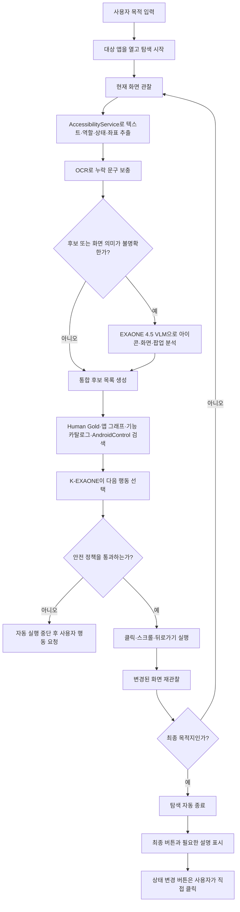
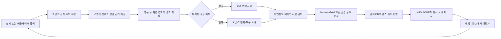

# EGL Navigation Agent 학습 아키텍처

## 목표

ExitGuide Navigation은 사전 좌표 경로가 없는 Android 앱에서도 현재 화면을 해석하고, 사용자의 목적에 가장 적합한 다음 메뉴를 동적으로 선택해 최종 목적지까지 안내하는 범용 Navigation Agent를 목표로 한다.

Gold는 좌표와 클릭 순서를 그대로 재생하는 매크로가 아니다. Gold는 특정 목적과 화면에서 어떤 후보를 선택해야 했는지, 어떤 후보가 실패했는지, 선택 이후 어떤 화면에 도착했는지를 담는 의미 기반 정답 데이터다. K-EXAONE은 Gold와 범용 기능 지식을 참고해 현재 화면의 후보 중 다음 행동을 결정한다.

## 구성 요소와 책임

| 구성 요소 | 책임 |
| --- | --- |
| Android AccessibilityService | 화면의 텍스트, 역할, 상태, 계층, 좌표와 클릭 가능 후보 수집 |
| OCR | 접근성 트리에서 누락되거나 잘린 화면 문구 보충 |
| EXAONE 4.5 VLM | 이름 없는 아이콘, 이미지 버튼, WebView, Canvas, 팝업과 시각 상태 해석 |
| K-EXAONE | 사용자 목적, 현재 화면 맥락, 후보와 검색 근거를 보고 다음 행동 선택 |
| 범용 기능 카탈로그 | 회원가입, 탈퇴, 구독, 알림 등 기능 의미와 동의어, 기능 간 관계 제공 |
| AndroidControl | 처음 보는 앱에서 목적을 중간 기능으로 분해하는 범용 탐색 사전 근거 제공 |
| 앱 기능 그래프 | 실제로 관찰된 화면, 메뉴, 행동과 화면 전환 관계 저장 |
| Human Gold | 실제 앱에서 성공하고 사람이 독립 검증한 고품질 선택 사례 제공 |
| Android 안전 실행기 | 모델이 선택한 클릭, 스크롤, 뒤로가기를 정책 검사 후 실행 |

요약하면 EXAONE 4.5는 눈, K-EXAONE은 판단하는 두뇌, Gold·AndroidControl·기능 그래프는 기억, Android 실행기는 손이다.

## 온라인 Navigation 워크플로우



Accessibility 정보만으로 의미와 대상을 확정할 수 있으면 VLM 호출을 생략한다. OCR로도 해결되지 않는 이름 없는 아이콘, 접근성 정보가 비어 있는 화면, 시각 상태가 중요한 선택지, 반복 탐색 또는 저신뢰 상황에서만 VLM을 호출한다. 동일한 화면과 후보의 시각 분석 결과는 화면 지문과 모델 버전으로 캐시한다.

## 후보 선택 계약

화면 분석기는 모델에 좌표만 전달하지 않는다. 접근성, OCR, VLM 정보를 같은 후보 ID에 결합한다.

```json
{
  "goal": "유튜브 프리미엄을 해지하고 싶어",
  "screen_context": "유튜브 마이페이지",
  "candidates": [
    {
      "id": "c1",
      "accessibility_label": "시청 기록",
      "role": "button",
      "enabled": true
    },
    {
      "id": "c2",
      "accessibility_label": "구매 항목 및 멤버십",
      "role": "button",
      "enabled": true
    },
    {
      "id": "c3",
      "accessibility_label": "",
      "visual_label": "설정",
      "icon_type": "gear",
      "role": "image_button",
      "enabled": true
    }
  ]
}
```

K-EXAONE은 Hermes 도구 호출 규격에 맞춘 구조화된 결정을 반환한다.

```json
{
  "action": "click",
  "candidate_id": "c2",
  "reason": "구독 해지 목적은 멤버십 관리 기능과 가장 직접적으로 연결된다.",
  "confidence": 0.94
}
```

Android 실행기는 후보 ID를 현재 화면의 실제 요소와 다시 대조하고 안전 정책을 통과한 경우에만 행동을 실행한다. 모델이 임의의 좌표를 만들어 클릭하도록 허용하지 않는다.

## Gold 데이터 구조

Gold는 `좌표 A 클릭 → 좌표 B 클릭`이 아니라 `목적 + 현재 화면 + 전체 후보 + 올바른 선택 + 결과` 단위로 저장한다.

```json
{
  "app_package": "com.google.android.youtube",
  "app_version": "21.29.366",
  "locale": "ko-KR",
  "goal": "프리미엄 구독 해지",
  "target_function": "subscription.cancel.entry",
  "screen_fingerprint": "screen_123",
  "screen_context": "마이페이지",
  "candidates": [
    "시청 기록",
    "설정",
    "구매 항목 및 멤버십",
    "내 동영상"
  ],
  "correct_candidate": "구매 항목 및 멤버십",
  "incorrect_candidates": [
    "시청 기록",
    "내 동영상"
  ],
  "expected_next_function": "subscription.management",
  "outcome": "success",
  "verification": "human_gold"
}
```

성공 경로뿐 아니라 잘못 누른 후보, 화면 변화가 없었던 행동, 무한 피드 스크롤, 광고·이벤트 배너, 목적과 반대되는 메뉴와 되돌아간 경로도 부정 표본으로 보존한다. 이 자료는 같은 오답을 반복하지 않도록 후보 점수를 낮추고 복구 행동을 학습하는 데 사용한다.

## 학습 데이터 축적 워크플로우



데이터를 DB에 저장하는 것만으로 K-EXAONE의 가중치가 학습되는 것은 아니다. 초기 단계에서는 현재 상황과 유사한 Gold를 검색해 프롬프트에 제공하는 RAG·few-shot 방식으로 사용한다. 사람 검증 데이터가 충분히 쌓이면 앱 단위 누출이 없는 학습·개발·테스트 분할을 만든 뒤 파인튜닝 가능성과 효과를 별도로 평가한다.

## DB 계층과 조회 우선순위

1. **Human Gold와 검증된 앱 기능 그래프**: 같은 앱·버전·locale·목적에서 가장 강한 경험 근거
2. **같은 앱의 관찰 그래프**: 검증되지 않았지만 실제 화면에서 관찰된 후보와 전이
3. **범용 기능 카탈로그**: 기능 의미, 동의어, 중간 기능과 최종 기능 관계
4. **AndroidControl**: 처음 보는 앱에서 탐색 방향을 잡는 교차 앱 사전 근거
5. **K-EXAONE 판단**: 현재 후보와 위 근거를 종합해 다음 행동 결정

Gold가 있는 경우에도 좌표 경로를 무조건 재생하지 않는다. 현재 화면에서 동일 의미의 후보가 실제로 관찰되는지 검증하고 그 후보를 선택한다. 개발·평가 모드에서는 K-EXAONE을 매 의미 결정에 참여시켜 학습 효과를 측정한다. 운영 모드에서는 완전히 동일한 고신뢰 화면·후보 조합의 결정을 캐시할 수 있지만, 화면 의미가 달라지면 즉시 동적 판단으로 복귀한다.

## EXAONE 4.5 VLM 활용

### 실시간 인식

- 이름 없는 톱니바퀴, 연필, 프로필, 종, 닫기 아이콘 분류
- WebView·Canvas와 이미지 기반 메뉴 해석
- 팝업, 프로모션 배너와 실제 앱 메뉴 구분
- 선택·비활성·체크·토글 등 시각 상태 보충
- OCR 오인식과 접근성 정보 불일치 감지
- 탐색 정체 시 전체 화면의 기능 맥락 재분석

### 오프라인 교사 모델

A100 지원 기간에는 스크린샷 또는 개인정보를 제거한 후보 crop을 VLM으로 분석해 다음 구조화 정보를 생성한다.

- 화면 종류와 현재 탐색 단계
- 후보의 시각 라벨과 아이콘 종류
- 메뉴 기능과 위험 수준
- 최종 목적지 가능성
- 접근성·OCR·VLM 결과의 일치 여부
- 모델 버전, 분석 신뢰도와 사람 검증 여부

원본 이미지보다 구조화된 결과를 우선 보존한다. 지원 기간 종료 전에 필요한 DB, redacted crop과 평가 결과를 용량이 작은 형태로 반출한다. 기존 화면에 원본 또는 안전하게 가공된 이미지가 남아 있지 않으면 VLM으로 소급 분석할 수 없으므로 앞으로의 관찰 스키마에 시각 provenance를 포함한다.

## 안전 경계

- 자동 탐색은 보이고 활성화된 저위험 중간 메뉴에만 허용한다.
- 결제, 탈퇴, 해지 확정, 환불, 동의, 권한 변경, 토글, 체크박스, 라디오 버튼과 텍스트 입력은 자동 실행하지 않는다.
- 최종 목적지에 도착하면 탐색을 종료하고 최종 상태 변경은 사용자가 직접 수행한다.
- K-EXAONE과 VLM의 결과는 신뢰도와 근거를 기록하며, 화면과 후보를 식별할 수 없으면 추측 클릭 대신 중단 또는 복구한다.
- 민감 정보가 포함된 원본 스크린샷은 저장하지 않거나 저장 전 마스킹하며, 학습 자료에는 출처와 검증 상태를 남긴다.

## 현재 기반 현황

2026-08-01 운영 서버 스냅샷 기준으로 다음 기반이 있다.

- 범용 기능 2,866개
- 기능 별칭 53,017개
- 기능 맥락 109,230개
- 기능 간 연결 3,033개
- 사용자 의도 2,660개
- 목적 문장 패턴 67,092개
- 관찰 앱 39개
- 관찰 화면 824개
- 화면 행동 후보 15,325개
- 실제 화면 전환 434개
- 탐색 단계 917개
- 검증 후보 경로 6개
- 사람 검증 `human_gold` 세션 7개

범용 의미 데이터와 실행·저장 구조는 상당히 구축됐지만, 화면별 정답 후보를 학습시키는 Human Gold는 아직 적다. AndroidControl 변환·검색 파이프라인은 구현됐으나 공식 전체 데이터 인덱스는 현재 운영 서버에 적재되지 않았다. 따라서 현재 자료를 곧바로 충분한 파인튜닝 데이터라고 부르지 않고, 후보 선택 학습 형식으로 정규화하고 검증 범위를 늘려야 한다.

## 구현 우선순위

1. Gold·세션 기록을 `화면 + 전체 후보 + 정답 후보 + 결과` 학습 레코드로 변환한다.
2. 관찰 스키마에 OCR·VLM 라벨, 아이콘 유형, 신뢰도, 모델 버전과 이미지 provenance를 추가한다.
3. EXAONE 4.5 VLM을 저신뢰·무라벨·WebView 상황의 선택적 인식기로 연결하고 결과를 캐시한다.
4. AndroidControl 전체 성공 시연을 다운로드·정규화해 운영 검색 인덱스로 적재한다.
5. K-EXAONE이 Hermes 규격으로 매 단계 후보를 선택하도록 연결하고 Python은 정책 검사와 실행만 담당하게 한다.
6. 성공·실패·복구 데이터를 Human Gold와 부정 표본으로 검토·승격한다.
7. 앱을 통째로 분리한 테스트 세트에서 무경로 목적지 도달률, 잘못된 클릭, 안전 정지, UI 변경 복구와 탐색 시간을 측정한다.
8. 충분한 고품질 표본이 확보된 후에만 K-EXAONE 파인튜닝을 검토한다.

핵심 전환은 `Gold 좌표 경로 암기·재생`에서 `현재 화면 후보 분석 → 유사 경험 검색 → K-EXAONE 의미 판단 → 안전 실행 → 결과 재학습`으로 이동하는 것이다. 이 구조가 Gold가 없는 앱에서도 경험을 축적하며 개선되는 범용 Navigation Agent의 기준 구조다.
