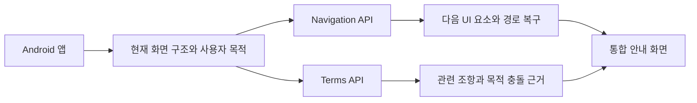

# 팀 통합 구조

## 1. 결론

ExitGuide는 하나의 제품이지만 개발 저장소는 책임에 따라 둘로 유지합니다.

```text
exitguide-ai/exitguide
├─ Terms 데이터 파이프라인
├─ Terms API
├─ 공통 계약
└─ 최종 ExitGuide 앱과 통합 조정

exitguide-ai/exitguide-navigation  (조직 이전 전: Sheep-gun/exitguide-navigation)
├─ Android AccessibilityService
├─ 화면 상태와 모범 경로 검색
├─ 다음 UI 요소 안내
└─ 경로 이탈 복구
```

서로의 코드를 복사하거나 Git submodule로 묶지 않습니다. 두 저장소는 독립적으로 배포하고, 최종 앱과 통합 백엔드가 버전이 명시된 API 계약으로 조합합니다.

## 2. 런타임 흐름



- Navigation은 사용자가 현재 화면에서 어디로 이동할지 판단합니다.
- Terms는 화면과 목적에 관련된 약관 근거를 검색하고 설명합니다.
- 최종 앱은 두 결과를 나란히 표시하며 한 모듈의 실패가 다른 모듈을 막지 않게 합니다.
- 자동 클릭은 하지 않고 사용자가 직접 행동합니다.

## 3. 소유권

| 영역 | 주 담당 | 변경 위치 |
| --- | --- | --- |
| 약관 원본 수집·정규화·검수 | 김군협 | `exitguide`의 `fixtures/`, `scripts/`, `.artifacts/` |
| 약관 검색·근거 API | 김군협 | `exitguide`의 `apps/api/app/routers/terms.py`, `services/terms_*` |
| 최종 앱과 통합 조정 | 김군협 | `exitguide`의 `apps/mobile/`, `contracts/` |
| Android 화면 인식·플로팅 UI | 양건 | `exitguide-navigation`의 `apps/mobile/` |
| 모범 경로·Navigation API | 양건 | `exitguide-navigation`의 `data/routes/`, `apps/api/` |

공유 파일은 [`contracts/`](../contracts/README.md)에만 둡니다. 담당 경계 밖 변경은 PR에서 상대 담당자의 검토를 받습니다.

## 4. 결합 계약

공통 연결 키:

- `request_id`: 같은 사용자 요청의 두 API 결과를 묶는 키
- `app_package`: 대상 Android 앱 식별자
- `goal_id`: [`contracts/goals.v1.json`](../contracts/goals.v1.json)의 사용자 목적

Navigation v1 계약은 상대 저장소의 [`INTEGRATION_CONTRACT.md`](https://github.com/Sheep-gun/exitguide-navigation/blob/main/docs/INTEGRATION_CONTRACT.md)를 기준으로 합니다. Terms의 현재 검색 계약은 [`API_CONTRACT.md`](API_CONTRACT.md)를 기준으로 합니다.

## 5. GitHub 운영

최종 형태는 `exitguide-ai` 조직 아래 두 저장소가 나란히 보이는 구조입니다.

1. `gam5247/exitguide`를 `exitguide-ai/exitguide`로 이전합니다.
2. 양건이 조직 초대를 수락한 뒤 `Sheep-gun/exitguide-navigation`을 `exitguide-ai/exitguide-navigation`으로 이전합니다.
3. 저장소별 브랜치와 이슈는 독립적으로 운영합니다.
4. 공통 계약 변경은 두 저장소에서 동시에 검증한 뒤 병합합니다.
5. 최종 앱 통합 작업은 `exitguide`에서 수행합니다.

이 구조는 두 사람의 작업 속도를 유지하면서도 제품, 저장소, API 책임을 한눈에 구분하게 합니다.
